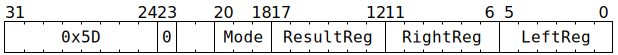
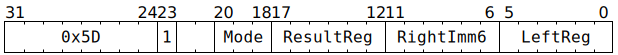

# `CMPDMAREG` (Perform comparison on GPRs)

**Summary:** Performs an unsigned comparison (less than, greater than, or equal) between two Tensix GPRs, or between a Tensix GPR and an unsigned 6-bit immediate. The result is a single bit (true or false).

**Backend execution unit:** [Scalar Unit (ThCon)](ScalarUnit.md)

## Syntax

```c
TT_CMPDMAREG(0, /* u3 */ Mode, /* u6 */ ResultReg, /* u6 */ RightReg , /* u6 */ LeftReg)
TT_CMPDMAREG(1, /* u3 */ Mode, /* u6 */ ResultReg, /* u6 */ RightImm6, /* u6 */ LeftReg)
```

## Encoding




## Functional model

```c
uint32_t LeftVal = GPRs[CurrentThread][LeftReg];
uint32_t RightVal = GPRs[CurrentThread][RightReg]; // RightReg  variant
uint32_t RightVal = RightImm6;                     // RightImm6 variant
bool ResultVal;
switch (Mode) {
case CMPDMAREG_MODE_GT: ResultVal = LeftVal  > RightVal; break;
case CMPDMAREG_MODE_LT: ResultVal = LeftVal <  RightVal; break;
case CMPDMAREG_MODE_EQ: ResultVal = LeftVal == RightVal; break;
default: UndefinedBehaviour(); break;
}
GPRs[CurrentThread][ResultReg] = ResultVal ? 1 : 0;
```

Supporting definitions:
```c
#define CMPDMAREG_MODE_GT 0
#define CMPDMAREG_MODE_LT 1
#define CMPDMAREG_MODE_EQ 2
```

## Performance

The `RightImm6` variant takes three cycles. The `RightReg` variant takes three cycles if `LeftReg` and `RightReg` come from the same aligned group of four GPRs, or four cycles otherwise.
