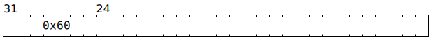

# `DMANOP` (Occupy Scalar Unit for one cycle)

**Summary:** Does nothing other than occupying the Scalar Unit (ThCon) for one cycle.

**Backend execution unit:** [Scalar Unit (ThCon)](ScalarUnit.md)

## Syntax

```c
TTI_DMANOP
```

## Encoding



## Functional model

```c
// Causes no effects
```

## Performance

This instruction executes in a single cycle, though if the Scalar Unit (ThCon) is busy with other instructions, it might have to wait at the Wait Gate until the Scalar Unit (ThCon) can accept it.
