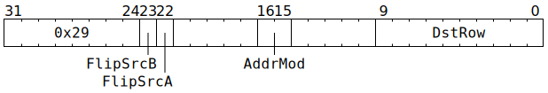

# `DOTPV` (`Dst += SrcB @ SrcA` matrix multiply)

**Summary:** This instruction is identical to [`MVMUL`](MVMUL.md), except that it lacks the `BroadcastSrcBRow` option (`BroadcastSrcBRow` is always taken to be `false`). `MVMUL` should always be used in preference to this instruction.

**Backend execution unit:** [Matrix Unit (FPU)](MatrixUnit.md)

## Syntax

```c
TT_DOTPV(((/* bool */ FlipSrcB) << 1) +
           /* bool */ FlipSrcA,
           true,
           0,
           /* u2 */ AddrMod,
           /* u10 */ DstRow)
```

## Encoding



## Functional model

`DOTPV`'s functional model is identical to [`MVMUL`'s functional model](MVMUL.md#functional-model), except that `BroadcastSrcBRow` is always `false`.
