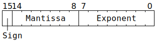
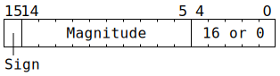
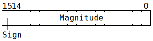
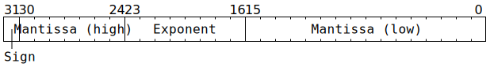
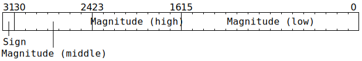

# `Dst`

The `Dst` register can be viewed as either having 1024 rows and 16 columns of 16-bit data, or 512 rows and 16 columns of 32-bit data. Instruction descriptions use `Dst16b` for the former, and `Dst32b` for the latter. In either case, the underlying storage is the same:

```c
uint16_t DstBits[1024][16];
```

Most of the time, `Dst16b[Row][Col]` is simple syntactic sugar for `DstBits[Row][Col]`.

The same region of memory can instead be viewed as a 512x16 matrix of 32-bit data; reads from `Dst32b[Row][Col]` give `(DstBits[AdjRow][Col] << 16) | DstBits[AdjRow + 8][Col]` where `AdjRow = ((Row & 0x1f8) << 1) | (Row & 0x207)`, and writes to `Dst32b[Row][Col]` perform the inverse unpacking and write to `DstBits[AdjRow][Col]` and `DstBits[AdjRow + 8][Col]`. At any given time, software is expected to be exclusively using `Dst16b` or exclusively using `Dst32b`; mixing and matching `Dst16b` and `Dst32b` is _possible_, but tends to require great care. When using `Dst32b`, `Row` remains a 10-bit index, though the mapping down to `AdjRow` can only yield 512 distinct values.

If bit 11 of `RISCV_DEBUG_REG_DBG_FEATURE_DISABLE` is set, then `Dst16b[Row][Col]` stops being syntactic sugar for `DstBits[Row][Col]`, and instead reads from `Dst16b[Row][Col]` give the high 16 bits of `Dst32b[Row][Col]`, and writes to `Dst16b[Row][Col]` write to the high 16 bits of `Dst32b[Row][Col]` (and also write _something_ - generally garbage - to the low 16 bits).

## Data types

Each datum in `Dst16b` is up to 16 bits wide, holding one of:
* **BF16 (1 sign bit, 8 bit exponent, 7 bit mantissa)**. Unpackers can losslessly convert BFP8 / BFP4 / BFP2 to BF16.
* **FP16 (1 sign bit, 5 bit exponent, 10 bit mantissa)**. Unpackers can losslessly convert FP8 (1 sign bit, 5 bit exponent, 3 bit mantissa) to FP16. They can also losslessly convert BFP8a / BFP4a / BFP2a to FP16.
* **Integer "8" (1 sign bit, 10 bit magnitude)**. The range of this type is -1023 through +1023, albeit the majority of hardware conversions to/from this type involve a range of -127 through +127 or 0 through 255. Internally, this type is overlaid onto FP16, using a fixed raw exponent of 16 (or sometimes a raw exponent of 0 when the magnitude is zero).
* **Integer "16" (1 sign bit, 15 bit magnitude)**. This type is intended only for opaque data transfer of 16 bits; there are no computation instructions involving this type. If used for opaque data transfer, this type can be used to contain _any_ 16 bits, including unsigned 16-bit data.

Each datum in `Dst32b` is 32 bits wide, holding one of:
* **FP32 (1 sign bit, 8 bit exponent, 23 bit mantissa)**. TF32 data can also be stored in this form, though most computation instructions will operate on it with full FP32 precision for as long as it is in `Dst32b`.
* **Integer "32" (1 sign bit, 31 bit magnitude)**. This is a sign/magnitude format rather than a two's complement format, though the Vector Unit (SFPU) can convert between the two.

Note that the coprocessor does not entirely conform to IEEE 754 for FP32 / FP16 / BF16. See [floating-point bit patterns](FloatBitPatterns.md) for details.

## Data type bit layout

Most of the time, software does not need to care about the exact bit layout of types in `Dst`. Nevertheless, the information is provided here to clarify the semantics of what happens if software does an implicit `bitcast` from one type to another.

**BF16:**



**FP16:**


The representation of infinity differs from IEEE 754, and NaN is not supported; see [FP16 bit patterns](FloatBitPatterns.md#fp16) for details.

**Integer "8":**



The low five bits usually contain the value `16`, but unpackers will instead set these bits to `0` when the magnitude is zero.

**Integer "16":**



**FP32:**



**Integer "32":**



## Moving data around

Unpacker 0 can be used to move from L1 to Dst (`UNPACR`), and [packers](Packers/README.md) can be used to move from Dst back to L1 ([`PACR`](PACR.md)).

The Vector Unit (SFPU) can move from Dst to LReg (`SFPLOAD`) and from LReg to Dst (`SFPSTORE`).

The Matrix Unit (FPU) can move from Dst to SrcA (`MOVD2A`) and from Dst to SrcB (`MOVD2B`). The other direction usually involves computation instructions rather than movement instructions, but plain movement is possible via `MOVA2D` and `MOVB2D`.

## Instruction scheduling

After issuing an instruction which writes to `Dst`, then for the next four cycles, the aligned 8x16 block of `Dst` containing that write cannot be read. If a thread presents a Matrix Unit (FPU) or [`PACR`](PACR.md) instruction which wants to read from that block, then hardware will automatically stall the thread for an appropriate number of cycles. In particular, for instructions which accumulate onto `Dst` (such as [`MVMUL`](MVMUL.md), [`GAPOOL`](GAPOOL.md), [`DOTPV`](DOTPV.md), [`GMPOOL`](GMPOOL.md), [`ELWMUL`](ELWMUL.md)), software needs to be looping over at least five distinct 8x16 blocks of `Dst` to avoid being stalled. Additionally, if using multiple fidelity phases, with one loop over blocks of `Dst` and one loop over fidelity phases, then the fidelity loop should be the _outer_ loop to avoid being stalled.
