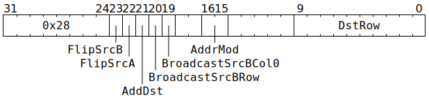

# `ELWADD` (`Dst = SrcA + SrcB` or `Dst += SrcA + SrcB`)

**Summary:** An aligned 8x16 block of `SrcA` is added element-wise to an aligned 8x16 block of `SrcB`, and the result either assigned to an aligned 8x16 block of `Dst` or added element-wise to an aligned 8x16 block of `Dst`. Broadcasting is supported on the `SrcB` operand; any 1x16 row can be broadcasted up to 8x16 and/or column 0 can be broadcasted to all columns.

The supported data type combinations are:

|[`Dst` data type](Dst.md#data-types)|= or +=|[`SrcA` data type](SrcASrcB.md#data-types)|+|[`SrcB` data type](SrcASrcB.md#data-types)|
|---|---|---|---|---|
|8x16 matrix of either FP32 or BF16|= or +=|8x16 matrix of either TF32 or BF16|+|8x16 matrix of either TF32 or BF16|
|8x16 matrix of either FP32 or FP16|= or +=|8x16 matrix of FP16|+|8x16 matrix of FP16|
|8x16 matrix of integer "32"|= or +=|8x16 matrix of integer "8"|+|8x16 matrix of integer "8"|

When `Dst += SrcA + SrcB` is performed for integers, the computation is really `Dst = Saturate(Dst + SrcA + SrcB)`, where `Saturate` clamps at ±(2<sup>31</sup>-1).

**Backend execution unit:** [Matrix Unit (FPU)](MatrixUnit.md)

## Syntax

```c
TT_ELWADD(((/* bool */ FlipSrcB) << 1) +
            /* bool */ FlipSrcA,
            /* bool */ AddDst,
          ((/* bool */ BroadcastSrcBRow) << 1) +
            /* bool */ BroadcastSrcBCol0,
            /* u2 */ AddrMod,
            /* u10 */ DstRow)
```

## Encoding



## Functional model

This instruction will, if necessary, spend time waiting at the Wait Gate before being dispatched to the Matrix Unit (FPU):

```c
while (SrcA[MatrixUnit.SrcABank].AllowedClient != MatrixUnit
    || SrcB[MatrixUnit.SrcBBank].AllowedClient != MatrixUnit) {
  wait;
}
```

Once dispatched to the Matrix Unit (FPU):
```c
uint1_t StateID = ThreadConfig[CurrentThread].CFG_STATE_ID_StateID;
auto& ConfigState = Config[StateID];

// Determine the data formats.
uint4_t SrcAStyle;
bool UseDst32b;
if (ThreadConfig[CurrentThread].FP16A_FORCE_Enable) {
  SrcAStyle = FP16;
  UseDst32b = false;
} else if (ConfigState.ALU_ACC_CTRL_INT8_math_enabled) {
  SrcAStyle = INT8;
  UseDst32b = true;
} else {
  uint4_t SrcAFmt = ConfigState.ALU_FORMAT_SPEC_REG_SrcA_override ? ConfigState.ALU_FORMAT_SPEC_REG_SrcA_val : ConfigState.ALU_FORMAT_SPEC_REG0_SrcA;
  if (SrcAFmt in {FP32, BF16, BFP8, BFP4, BFP2, INT32, INT16}) {
    SrcAStyle = BF16;
  } else if (SrcAFmt in {FP16, FP8, BFP8a, BFP4a, BFP2a, INT8}) {
    SrcAStyle = FP16;
  } else /* SrcAFmt == TF32 */ {
    SrcAStyle = TF32;
  }
  UseDst32b = ConfigState.ALU_ACC_CTRL_Fp32_enabled;
}

// Determine the row range.
uint6_t SrcARow = RWCs[CurrentThread].SrcA & 0x38;
uint6_t SrcBRow = RWCs[CurrentThread].SrcB & (BroadcastSrcBRow ? 0x3f : 0x38);
DstRow += ThreadConfig[CurrentThread].DEST_TARGET_REG_CFG_MATH_Offset;
DstRow += RWCs[CurrentThread].Dst + ConfigState.DEST_REGW_BASE_Base;
DstRow &= 0x3f8;

// Determine the fidelity phase.
uint2_t FidelityPhase = RWCs[CurrentThread].FidelityPhase;
FidelityPhase += ThreadConfig[CurrentThread].FIDELITY_BASE_Phase;
FidelityPhase &= 3;

// Perform the element-wise computation.
for (unsigned i = 0; i < 8; ++i) {
  for (unsigned j = 0; j < 16; ++j) {
    uint19_t SrcAVal = SrcA[MatrixUnit.SrcABank][SrcARow + i][j];
    uint19_t SrcBVal = SrcB[MatrixUnit.SrcBBank][SrcBRow + (BroadcastSrcBRow ? 0 : i)][BroadcastSrcBCol0 ? 0 : j];
    if (SrcAStyle == INT8) {
      int32_t SrcAValInt = ReadSrcInt8(SrcAVal);
      int32_t SrcBValInt = ReadSrcInt8(SrcBVal);
      int32_t Result = SrcAValInt + SrcBValInt;
      // Dst is INT32.
      if (AddDst) Result = SaturateAddInt32(Result, ReadDstInt32(Dst32b[DstRow + i][j]));
      Dst32b[DstRow + i][j] = WriteDstInt32(Result);
    } else {
      float SrcAValFP, SrcBValFP;
      switch (SrcAStyle) {
      case BF16: SrcAValFP = ReadBF16(SrcAVal), SrcBValFP = ReadBF16(SrcBVal); break;
      case FP16: SrcAValFP = ReadFP16(SrcAVal), SrcBValFP = ReadFP16(SrcBVal); break;
      case TF32: SrcAValFP = ReadTF32(SrcAVal), SrcBValFP = ReadTF32(SrcBVal); break;
      }
      float Result = SrcAValFP + SrcBValFP;
      if (FidelityPhase & 1) Result /= 32.f;  // These divisions are rarely desirable, so software
      if (FidelityPhase & 2) Result /= 128.f; // is encouraged to ensure that FidelityPhase == 0.
      if (UseDst32b) {
        // Dst is FP32, regardless of SrcAStyle.
        if (AddDst) Result += ReadDstFP32(Dst32b[DstRow + i][j]);
        Dst32b[DstRow + i][j] = WriteDstFP32(Result);
      } else if (SrcAStyle == FP16) {
        // Dst is FP16, just like SrcAStyle.
        if (AddDst) Result += ReadDstFP16(Dst16b[DstRow + i][j]);
        Dst16b[DstRow + i][j] = WriteDstFP16(RoundToFP16(Result));
      } else {
        // Dst is BF16 (SrcAStyle is either BF16 or TF32).
        if (AddDst) Result += ReadDstBF16(Dst16b[DstRow + i][j]);
        Dst16b[DstRow + i][j] = WriteDstBF16(RoundToBF16(Result));
      } 
    }
  }
}

// Possibly flip source banks.
if (FlipSrcA) {
  if (!ThreadConfig[CurrentThread].CLR_DVALID_SrcA_Disable) {
    SrcA[MatrixUnit.SrcABank].AllowedClient = SrcClient::Unpackers;
  }
  MatrixUnit.SrcABank ^= 1;
}
if (FlipSrcB) {
  if (!ThreadConfig[CurrentThread].CLR_DVALID_SrcB_Disable) {
    SrcB[MatrixUnit.SrcBBank].AllowedClient = SrcClient::Unpackers;
  }
  MatrixUnit.SrcBBank ^= 1;
}

// Advance the RWCs.
ApplyAddrMod(AddrMod);
```

For floating-point computation, the functional model should be taken as a rough guide rather than an exact description: operations might be performed in a different order to that shown, various operations might be fused together, and precision could be either lower or higher than what is shown. Denormals will be flushed to zero, and handling of NaN/infinity does _not_ conform to IEEE754.
