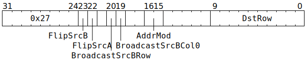

# `ELWMUL` (`Dst += SrcA * SrcB` element-wise)

**Summary:** An aligned 8x16 block of `SrcA` is multiplied element-wise with an aligned 8x16 block of `SrcB`, and the result added element-wise to an aligned 8x16 block of `Dst`. Broadcasting is supported on the `SrcB` operand; any 1x16 row can broadcasted up to 8x16 and/or column 0 can be broadcasted to all columns. The hardware multipliers consume at most 5 bits of `SrcA` magnitude/mantissa and at most 7 bits of `SrcB` magnitude/mantissa, so software may wish to execute up to four separate fidelity phases, subject to the precision of the input data and the desired output precision. To get the effect of `Dst = SrcA * SrcB` (i.e. `=` rather than `+=`), [`ZEROACC`](ZEROACC.md) can be used prior to `ELWMUL`, as `ELWMUL` reads undefined rows as zero.

The supported data type combinations are:

|[`Dst` data type](Dst.md#data-types)|+=|[`SrcA` data type](SrcASrcB.md#data-types)|*|[`SrcB` data type](SrcASrcB.md#data-types)|
|---|---|---|---|---|
|8x16 matrix of either FP32 or BF16|+=|8x16 matrix of either TF32 (†) or BF16|*|8x16 matrix of either TF32 or BF16|
|8x16 matrix of either FP32 or FP16|+=|8x16 matrix of FP16 (†)|*|8x16 matrix of FP16|
|8x16 matrix of integer "32"|+=|8x16 matrix of integer "8" (‡)|*|8x16 matrix of integer "8"|

(†) For `SrcA`, the least significant bit of the FP16 or TF32 mantissa is ignored in multiplication operations.

(‡) For `SrcA`, the most significant two bits of the integer "8" magnitude are ignored in multiplication operations, leaving just the low eight bits of magnitude. The usable values are therefore -255 through +255.

When `Dst += SrcA * SrcB` is performed for integers, the computation is really `Dst = Saturate(Dst + SrcA * SrcB)`, where `Saturate` clamps at ±(2<sup>31</sup>-1).

**Backend execution unit:** [Matrix Unit (FPU)](MatrixUnit.md)

## Syntax

```c
TT_ELWMUL(((/* bool */ FlipSrcB) << 1) +
            /* bool */ FlipSrcA,
            true,
          ((/* bool */ BroadcastSrcBRow) << 1) +
            /* bool */ BroadcastSrcBCol0,
            /* u2 */ AddrMod,
            /* u10 */ DstRow)
```

## Encoding



## Functional model

This instruction will, if neccessary, spend time waiting at the Wait Gate before being dispatched to the Matrix Unit (FPU):

```c
while (SrcA[MatrixUnit.SrcABank].AllowedClient != MatrixUnit
    || SrcB[MatrixUnit.SrcBBank].AllowedClient != MatrixUnit) {
  wait;
}
```

Once dispatched to the Matrix Unit (FPU):
```c
uint1_t StateID = ThreadConfig[CurrentThread].CFG_STATE_ID_StateID;
auto& ConfigState = Config[StateID];

// Determine the data formats.
uint4_t SrcAStyle;
bool UseDst32b;
if (ThreadConfig[CurrentThread].FP16A_FORCE_Enable) {
  SrcAStyle = FP16;
  UseDst32b = false;
} else if (ConfigState.ALU_ACC_CTRL_INT8_math_enabled) {
  SrcAStyle = INT8;
  UseDst32b = true;
} else {
  uint4_t SrcAFmt = ConfigState.ALU_FORMAT_SPEC_REG_SrcA_override ? ConfigState.ALU_FORMAT_SPEC_REG_SrcA_val : ConfigState.ALU_FORMAT_SPEC_REG0_SrcA;
  if (SrcAFmt in {FP32, BF16, BFP8, BFP4, BFP2, INT32, INT16}) {
    SrcAStyle = BF16;
  } else if (SrcAFmt in {FP16, FP8, BFP8a, BFP4a, BFP2a, INT8}) {
    SrcAStyle = FP16;
  } else /* SrcAFmt == TF32 */ {
    SrcAStyle = TF32;
  }
  UseDst32b = ConfigState.ALU_ACC_CTRL_Fp32_enabled;
}

// Determine the row range.
uint6_t SrcARow = RWCs[CurrentThread].SrcA & 0x38;
uint6_t SrcBRow = RWCs[CurrentThread].SrcB & (BroadcastSrcBRow ? 0x3f : 0x38);
DstRow += ThreadConfig[CurrentThread].DEST_TARGET_REG_CFG_MATH_Offset;
DstRow += RWCs[CurrentThread].Dst + ConfigState.DEST_REGW_BASE_Base;
DstRow &= 0x3f8;

// Determine the fidelity phase.
uint2_t FidelityPhase = RWCs[CurrentThread].FidelityPhase;
FidelityPhase += ThreadConfig[CurrentThread].FIDELITY_BASE_Phase;
FidelityPhase &= 3;

// Perform the element-wise computation.
for (unsigned i = 0; i < 8; ++i) {
  for (unsigned j = 0; j < 16; ++j) {
    uint19_t SrcAVal = SrcA[MatrixUnit.SrcABank][SrcARow + i][j];
    uint19_t SrcBVal = SrcB[MatrixUnit.SrcBBank][SrcBRow + (BroadcastSrcBRow ? 0 : i)][BroadcastSrcBCol0 ? 0 : j];
    if (SrcAStyle == INT8) {
      int32_t SrcAValInt = ReadSrcInt8(SrcAVal & (FidelityPhase & 1 ? 0x41fff : 0x4e0ff));
      int32_t SrcBValInt = ReadSrcInt8(SrcBVal & (FidelityPhase & 2 ? 0x40fff : 0x7f0ff));
      int32_t Result = SrcAValInt * SrcBValInt;
      // Dst is INT32.
      Result = SaturateAddInt32(Result, ReadDstInt32(Dst32b[DstRow + i][j]));
      Dst32b[DstRow + i][j] = WriteDstInt32(Result);
    } else {
      float SrcAValFP, SrcBValFP;
      switch (SrcAStyle) {
      case BF16: SrcAValFP = ReadBF16(SrcAVal), SrcBValFP = ReadBF16(SrcBVal); break;
      case FP16: SrcAValFP = ReadFP16(SrcAVal), SrcBValFP = ReadFP16(SrcBVal); break;
      case TF32: SrcAValFP = ReadTF32(SrcAVal), SrcBValFP = ReadTF32(SrcBVal); break;
      }
      float Result = SrcAFidelityBits(SrcAValFP, FidelityPhase) * SrcBFidelityBits(SrcBValFP, FidelityPhase);
      if (UseDst32b) {
        // Dst is FP32, regardless of SrcAStyle.
        Result += ReadDstFP32(Dst32b[DstRow + i][j]);
        Dst32b[DstRow + i][j] = WriteDstFP32(Result);
      } else if (SrcAStyle == FP16) {
        // Dst is FP16, just like SrcAStyle.
        Result += ReadDstFP16(Dst16b[DstRow + i][j]);
        Dst16b[DstRow + i][j] = WriteDstFP16(RoundToFP16(Result));
      } else {
        // Dst is BF16 (SrcAStyle is either BF16 or TF32).
        Result += ReadDstBF16(Dst16b[DstRow + i][j]);
        Dst16b[DstRow + i][j] = WriteDstBF16(RoundToBF16(Result));
      } 
    }
  }
}

// Possibly flip source banks.
if (FlipSrcA) {
  if (!ThreadConfig[CurrentThread].CLR_DVALID_SrcA_Disable) {
    SrcA[MatrixUnit.SrcABank].AllowedClient = SrcClient::Unpackers;
  }
  MatrixUnit.SrcABank ^= 1;
}
if (FlipSrcB) {
  if (!ThreadConfig[CurrentThread].CLR_DVALID_SrcB_Disable) {
    SrcB[MatrixUnit.SrcBBank].AllowedClient = SrcClient::Unpackers;
  }
  MatrixUnit.SrcBBank ^= 1;
}

// Advance the RWCs.
ApplyAddrMod(AddrMod);
```

For floating-point computation, the functional model should be taken as a rough guide rather than an exact description: operations might be performed in a different order to that shown, various operations might be fused together, and precision could be either lower or higher than what is shown. Denormals will be flushed to zero, and handling of NaN/infinity does _not_ conform to IEEE754.

Supporting definitions:
```c
int32_t ReadSrcInt8(uint19_t x) {
  // Src holds INT8 as Sign,Mag(10b),Zero(3b),Exp(5b)
  uint1_t Sign = x >> 18;
  uint10_t Mag = (x >> 8) & 0x3ff;
  return Sign ? -(int32_t)Mag : (int32_t)Mag;
}

float SrcAFidelityBits(float x, uint2_t FidelityPhase) {
  union {uint32_t u; float f;} bits;
  bits.f = x;
  if ((FidelityPhase & 1) == 0) {
    bits.u &= 0xfff80000; // Sign, Exp, implicit 1 of Man, next four Man bits.
    return bits.f;
  } else {
    bits.u &= 0xfff83fff; // Isolate the next five Man bits not consumed by prior branch.
    return x - bits.f;
  }
}

float SrcBFidelityBits(float x, uint2_t FidelityPhase) {
  union {uint32_t u; float f;} bits;
  bits.f = x;
  if ((FidelityPhase & 2) == 0) {
    bits.u &= 0xfffe0000; // Sign, Exp, implicit 1 of Man, next six Man bits.
    return bits.f;
  } else {
    bits.u &= 0xfffe1fff; // Isolate the next four Man bits not consumed by prior branch.
    return x - bits.f;
  }
}
```
