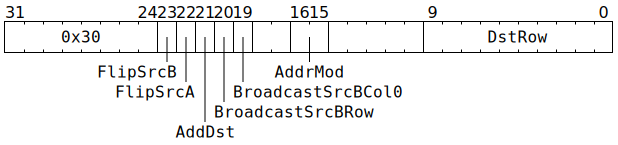

# `ELWSUB` (`Dst = SrcA - SrcB` or `Dst += SrcA - SrcB`)

**Summary:** An aligned 8x16 block of `SrcB` is subtracted element-wise from an aligned 8x16 block of `SrcA`, and the result either assigned to an aligned 8x16 block of `Dst` or added element-wise to an aligned 8x16 block of `Dst`. Broadcasting is supported on the `SrcB` operand; any 1x16 row can broadcasted up to 8x16 and/or column 0 can be broadcasted to all columns.

The supported data type combinations are:

|[`Dst` data type](Dst.md#data-types)|= or +=|[`SrcA` data type](SrcASrcB.md#data-types)|-|[`SrcB` data type](SrcASrcB.md#data-types)|
|---|---|---|---|---|
|8x16 matrix of either FP32 or BF16|= or +=|8x16 matrix of either TF32 or BF16|-|8x16 matrix of either TF32 or BF16|
|8x16 matrix of either FP32 or FP16|= or +=|8x16 matrix of FP16|-|8x16 matrix of FP16|
|8x16 matrix of integer "32"|= or +=|8x16 matrix of integer "8"|-|8x16 matrix of integer "8"|

When `Dst += SrcA - SrcB` is performed for integers, the computation is really `Dst = Saturate(Dst + SrcA - SrcB)`, where `Saturate` clamps at ±(2<sup>31</sup>-1).

**Backend execution unit:** [Matrix Unit (FPU)](MatrixUnit.md)

## Syntax

```c
TT_ELWSUB(((/* bool */ FlipSrcB) << 1) +
            /* bool */ FlipSrcA,
            /* bool */ AddDst,
          ((/* bool */ BroadcastSrcBRow) << 1) +
            /* bool */ BroadcastSrcBCol0,
            /* u2 */ AddrMod,
            /* u10 */ DstRow)
```

## Encoding



## Functional model

`ELWSUB`'s functional model is identical to [`ELWADD`'s functional model](ELWADD.md#functional-model), except that:
* `int32_t Result = SrcAValInt + SrcBValInt;` changes to `int32_t Result = SrcAValInt - SrcBValInt;`
* `float Result = SrcAValFP + SrcBValFP;` changes to `float Result = SrcAValFP - SrcBValFP;`
