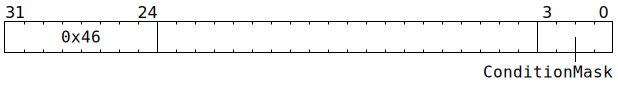

# `FLUSHDMA` (Occupy Scalar Unit until assorted conditions met)

**Summary:** One or more assorted conditions are selected using a bitmask, and until all of the selected conditions are simultaneously met, the thread executing `FLUSHDMA` will be stalled, as will any other thread attempting to execute a Scalar Unit (ThCon) instruction. In almost every case, it is preferable to use [`STALLWAIT`](STALLWAIT.md) (with the same condition mask, and all bits of the block mask set), as `STALLWAIT` will not block other threads from issuing Scalar Unit (ThCon) instructions.

**Backend execution unit:** [Scalar Unit (ThCon)](ScalarUnit.md)

## Syntax

```c
TT_FLUSHDMA(/* u4 */ ConditionMask)
```

## Encoding



## Functional model

```c
if (ConditionMask == 0) {
  ConditionMask = 0xF;
}
wait;
while (Any selected condition indicates keep on waiting) {
  wait;
}
```

## Condition mask

The condition mask consists of 4 bits, named C0 (least significant bit) through C3 (most significant bit). The meaning of each bit is:

||Keep on waiting if...|
|---|---|
|**C0**|The Scalar Unit (ThCon) has any memory requests still outstanding for the current thread.|
|**C1**|The current thread has an instruction in any stage of Unpacker 0's pipeline.|
|**C2**|The current thread has an instruction in any stage of Unpacker 1's pipeline.|
|**C3**|The current thread has an instruction in any stage of Packer 0's pipeline.|

If multiple condition bits are set in the condition mask, then the `FLUSHDMA` instruction will continue waiting if _any_ of the selected conditions indicate "keep on waiting" - the instruction will only finish execution once _all_ of the conditions are simultaneously met.

Note that these condition bits coincide _exactly_ with the low four bits of [`STALLWAIT`](STALLWAIT.md)'s condition mask.

## Performance

The instruction occupies the Scalar Unit (ThCon) for at least two cycles, and for as many additional cycles as required for the selected conditions to be met.
