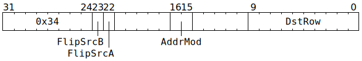

# `GAPOOL` (`Dst += SrcB @ SrcA` matrix multiply)

**Summary:** This instruction is almost identical to [`MVMUL`](MVMUL.md), except that it lacks the `BroadcastSrcBRow` option (`BroadcastSrcBRow` is always taken to be `false`), and `Dst` / `SrcB` are both 4x16 matrices rather than 8x16 matrices. The alignment restriction on `SrcB` is the same as for `MVMUL` though, so the 4x16 `SrcB` matrix is the top half of an aligned 8x16 matrix. The alignment restriction on `Dst` is however slightly laxer; it only needs to be an aligned 4x16 matrix. There are a few cases where this instruction can do something that `MVMUL` can't, but outside of those, software is encouraged to use `MVMUL` instead, as `MVMUL` achieves 2x the operations per second of `GAPOOL`.

**Backend execution unit:** [Matrix Unit (FPU)](MatrixUnit.md)

## Syntax

```c
TT_GAPOOL(((/* bool */ FlipSrcB) << 1) +
            /* bool */ FlipSrcA,
            0,
            /* u2 */ AddrMod,
            false,
            /* u10 */ DstRow)
```

## Encoding



## Functional model

`GAPOOL`'s functional model is identical to [`MVMUL`'s functional model](MVMUL.md#functional-model), except that:
* `BroadcastSrcBRow` is always `false`.
* `unsigned NumRows = BroadcastSrcBRow ? 7 : 8;` changes to `unsigned NumRows = 4;`. Note that this does not influence the masking in the computation of `SrcBRow`, so the 4x16 `SrcB` matrix is the top half of an aligned 8x16 matrix, but it does influence the masking in the computation of `DstRow`.
