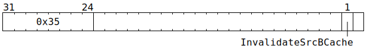

# `GATESRCRST` (Invalidate SrcB operand cache)

**Summary:** There is a one-slot operand cache between `SrcB` and the Matrix Unit (FPU). This instruction will forcibly invalidate the cache. It should only be required if there are hardware bugs in the cache invalidation logic.

**Backend execution unit:** [Matrix Unit (FPU)](MatrixUnit.md)

## Syntax

```c
TT_GATESRCRST(/* bool */ InvalidateSrcBCache, 0)
```

## Encoding


