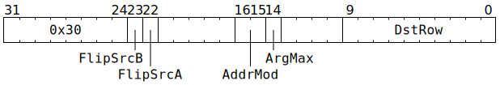

# `GMPOOL` (`max` reduction along `SrcA` columns)

**Summary:** An aligned 16x16 block of `SrcA` is reduced to a single 1x16 row by performing `max` along every column. An element-wise `max` is then performed between this 1x16 row and a 1x16 row from `Dst`, with the result written back to `Dst`. The row of `Dst` must be the top row of an aligned 4x16 block, and zero will be written to the other rows of the block. To get the effect of avoiding the element-wise `max` with `Dst`, [`ZEROACC`](ZEROACC.md) can be used prior to `GMPOOL`, as `GMPOOL` reads undefined rows as minus infinity (i.e. all bits set). When operating on floating-point data, the `SrcA` matrix is element-wise scaled before the `max` operation, where the matrix of scaling factors is formed by starting with a 1x16 row of `SrcB` (the top row of some aligned 8x16 block), taking just the exponents (i.e. element-wise `exp2 ∘ floor ∘ log2`), transposing that row to form a 16x1 column, and then broadcasting that column to a 16x16 matrix. If software does not want scaling, it should ensure that this 1x16 row of `SrcB` contains the value `1.0` in all datums.

The supported data type combinations are:

|[`Dst` data type](Dst.md#data-types)|[`SrcA` data type](SrcASrcB.md#data-types)|[`SrcB` data type](SrcASrcB.md#data-types) (exponent only, will be transposed)|
|---|---|---|
|1x16 row of either TF32 or BF16|16x16 matrix of either TF32 or BF16|1x16 row of either TF32 or BF16|
|1x16 row of either TF32 or FP16|16x16 matrix of FP16|1x16 row of FP16|
|1x16 row of integer "32" (†)|16x16 matrix of integer "8"|1x16 row of any type (‡)|

(†) For integer data in `Dst`, only the sign bit and the low 19 bits of magnitude are used for `max` input, and the magnitude is truncated to just 13 bits for `max` output.

(‡) Exponent of zero causes scaling by zero, and non-zero exponent causes scaling by one (i.e. no scaling). Non-zero datums always have a non-zero exponent.

There is also _partial_ support for `argmax`: within each column of `SrcA`, the _index_ of the largest value within the _first eight rows_ is tracked. Depending on the data type in use, this index can be returned as well as the largest value from all 16 rows, or instead of the largest value. A non-linear transform is applied to the index value, which software needs to reverse if it wants the original index value. In any event, the index value is only returned when `Dst` is accessed in 32-bit mode, with the index in the low bits (for FP16 or BF16 data, the largest value is simultaneously returned in the high 16 bits). The supported data type combinations for `argmax` are therefore:

|[`Dst` data type](Dst.md#data-types)|[`SrcA` data type](SrcASrcB.md#data-types)|[`SrcB` data type](SrcASrcB.md#data-types) (exponent only, will be transposed)|
|---|---|---|
|1x16 row of integer "32" (index only)|8x16 matrix of TF32|1x8 half-row of TF32|
|1x16 row of BF16 and integer "16" pairs|(16 or 8 †)x16 matrix of BF16|1x16 row of BF16|
|1x16 row of FP16 and integer "16" pairs|(16 or 8 †)x16 matrix of FP16|1x16 row of FP16|
|1x16 row of integer "32" (index only)|8x16 matrix of integer "8"|1x8 half-row of any type (‡)|

(†) 16x16 input matrix used for the BF16 or FP16 `max` part of the output, but only the top half of that (i.e. 8x16) used for the index part of the output.

(‡) Exponent of zero causes scaling by zero, and non-zero exponent causes scaling by one (i.e. no scaling). Non-zero datums always have a non-zero exponent.

**Backend execution unit:** [Matrix Unit (FPU)](MatrixUnit.md)

## Syntax

```c
TT_GMPOOL(((/* bool */ FlipSrcB) << 1) +
            /* bool */ FlipSrcA,
            true,
            /* u2 */ AddrMod,
            /* bool */ ArgMax,
            /* u10 */ DstRow)
```

## Encoding



## Functional model

This instruction will, if necessary, spend time waiting at the Wait Gate before being dispatched to the Matrix Unit (FPU):

```c
while (SrcA[MatrixUnit.SrcABank].AllowedClient != MatrixUnit
    || SrcB[MatrixUnit.SrcBBank].AllowedClient != MatrixUnit) {
  wait;
}
```

Once dispatched to the Matrix Unit (FPU):
```c
uint1_t StateID = ThreadConfig[CurrentThread].CFG_STATE_ID_StateID;
auto& ConfigState = Config[StateID];

// Determine the data formats.
uint4_t SrcAStyle, DstStyle;
bool UseDst32b;
if (ThreadConfig[CurrentThread].FP16A_FORCE_Enable) {
  SrcAStyle = FP16;
  DstStyle = FP16;
  UseDst32b = false;
} else if (ConfigState.ALU_ACC_CTRL_INT8_math_enabled) {
  SrcAStyle = INT8;
  DstStyle = INT32;
  UseDst32b = true;
} else {
  uint4_t SrcAFmt = ConfigState.ALU_FORMAT_SPEC_REG_SrcA_override ? ConfigState.ALU_FORMAT_SPEC_REG_SrcA_val : ConfigState.ALU_FORMAT_SPEC_REG0_SrcA;
  UseDst32b = ConfigState.ALU_ACC_CTRL_Fp32_enabled;
  if (SrcAFmt in {FP32, BF16, BFP8, BFP4, BFP2, INT32, INT16}) {
    SrcAStyle = BF16;
    if (ArgMax && UseDst32b) {
      DstStyle = BF16; // BF16 in high bits, with index returned in low bits.
    } else {
      DstStyle = UseDst32b ? TF32 : BF16;
    }
  } else if (SrcAFmt in {FP16, FP8, BFP8a, BFP4a, BFP2a, INT8}) {
    SrcAStyle = FP16;
    if (ArgMax && UseDst32b) {
      DstStyle = FP16; // FP16 in high bits, with index returned in low bits.
    } else {
      DstStyle = UseDst32b ? TF32 : FP16;
    }
  } else /* SrcAFmt == TF32 */ {
    SrcAStyle = TF32;
    if (ArgMax) {
      DstStyle = INT32;
    } else {
      DstStyle = UseDst32b ? TF32 : BF16;
    }
  }
}

struct Datum {
  uint1_t Sign;
  uint9_t Exponent;
  uint10_t MagOrMan;
};

// Determine the row range.
uint6_t SrcARow = RWCs[CurrentThread].SrcA & 0x30;
uint6_t SrcBRow = RWCs[CurrentThread].SrcB & 0x38;
DstRow += ThreadConfig[CurrentThread].DEST_TARGET_REG_CFG_MATH_Offset;
DstRow += RWCs[CurrentThread].Dst + ConfigState.DEST_REGW_BASE_Base;
DstRow &= 0x3fc;

// Iterate over SrcA columns.
for (unsigned j = 0; j < 16; ++j) {
  // Read value from Dst, use it as initial value of Max / MaxIndex.
  uint32_t DstVal;
  if (UseDst32b) {
    DstVal = Dst32b[DstRow][j];
  } else {
    DstVal = Dst16b[DstRow][j] << 16;
  }
  Datum Max = ReadDst(DstVal, DstStyle);
  uint8_t MaxIndex = DstVal & 0xff;
  uint32_t IndexPhase = (DstVal + 0x100) & 0xf00;
  // Iterate over SrcA rows (and SrcB columns), updating Max / MaxIndex.
  for (unsigned i_ = 0; i_ < 16; ++i_) {
    unsigned i = (i_ < 8) ? (i_ ^ 4) : i_; // Tweak the visitation order (only makes a difference for resolving ties in ArgMax)
    uint19_t SrcAVal = SrcA[MatrixUnit.SrcABank][SrcARow + i][j];
    uint19_t SrcBVal = SrcB[MatrixUnit.SrcBBank][SrcBRow    ][i];
    Datum x = ReadAndScaleSrc(SrcAVal, SrcAStyle, SrcBVal);
    if (AsComparable(x) >= AsComparable(Max)) {
      Max = x;
      static const uint8_t NONLINEAR_I_TRANSFORM[] = {0, 3, 6, 1, 4, 7, 2, 5};
      if (i < sizeof(NONLINEAR_I_TRANSFORM)) {
        MaxIndex = (IndexPhase >> 4) + NONLINEAR_I_TRANSFORM[i];
      }
    }
  }
  // Write result back to Dst.
  if (ArgMax) {
    uint32_t IndexResult = IndexPhase | MaxIndex;
    if (DstStyle == INT32) {
      DstVal = IndexResult;
    } else {
      DstVal = WriteDst(Max, DstStyle) | IndexResult;
    }
  } else {
    DstVal = WriteDst(Max, DstStyle);
  }
  if (UseDst32b) {
    Dst32b[DstRow][j] = DstVal;
    for (unsigned i = 1; i < 4; ++i) { // Zero or garbage to other three Dst rows.
      Dst32b[DstRow + i][j] = ArgMax ? (Dst32b[DstRow + i][j] + 0x100) & 0xf00 : 0;
    }
  } else {
    Dst16b[DstRow][j] = DstVal >> 16;
    for (unsigned i = 1; i < 4; ++i) { // Zero to other three Dst rows.
      Dst16b[DstRow + i][j] = 0;
    }
  }  
}

// Possibly flip source banks.
if (FlipSrcA) {
  if (!ThreadConfig[CurrentThread].CLR_DVALID_SrcA_Disable) {
    SrcA[MatrixUnit.SrcABank].AllowedClient = SrcClient::Unpackers;
  }
  MatrixUnit.SrcABank ^= 1;
}
if (FlipSrcB) {
  if (!ThreadConfig[CurrentThread].CLR_DVALID_SrcB_Disable) {
    SrcB[MatrixUnit.SrcBBank].AllowedClient = SrcClient::Unpackers;
  }
  MatrixUnit.SrcBBank ^= 1;
}

// Advance the RWCs.
ApplyAddrMod(AddrMod);
```

Supporting definitions:
```c
Datum ReadDst(uint32_t DstVal, uint4_t DstStyle) {
  Datum d;
  d.Sign = DstVal >> 31;
  switch (DstStyle) {
  case INT32:
    // Int32 in Dst is Sign,MagMiddle(7b),MagHi(8b),MagLo(16b)
    // Compute Mag = MagHi,MagMiddle,MagLo; then MagOrMan gets
    // low 10 bits of Mag and Exponent gets next 9.
    d.MagOrMan = DstVal & 0x3ff;
    d.Exponent = (DstVal >> 10) & 0x3f;
    d.Exponent += ((DstVal >> 24) & 7) << 6;
    break;
  case FP16:
    // High 16 bits of Dst has Sign,Man(10b),Exp(5b)
    d.Exponent = ((DstVal >> 16) & 0x1f) + 15;
    d.MagOrMan = (DstVal >> 21) & 0x3ff;
    break;
  case BF16:
  case TF32:
    // High 16 bits of Dst has Sign,Man(7b),Exp(8b)
    d.Exponent = ((DstVal >> 16) & 0xff) + 127;
    d.MagOrMan = ((DstVal >> 24) & 0x7f) << 3;
    if (DstStyle == TF32) {
      // Next three bits of Dst have more of Man.
      d.MagOrMan += (DstVal >> 13) & 7;
    }
    break;
  }
  return d;
}

uint32_t WriteDst(Datum d, uint4_t DstStyle) {
  switch (DstStyle) {
  case INT32:
    // Int32 in Dst is Sign,MagMiddle(7b),MagHi(8b),MagLo(16b)
    // Just the sign and 13 bits of magnitude are written here, the rest set to zero
    return (d.Sign << 31) | ((d.Exponent & 7) << 10) | d.MagOrMan;
  case FP16:
    if ((d.Exponent & 0x3f) == 0) {
      return 0;
    } else {
      d.Exponent -= 15; // Can cause wraparound if SrcB scaler wasn't 1.0!
      // High 16 bits of Dst has Sign,Man(10b),Exp(5b)
      return (d.Sign << 31) | (d.MagOrMan << 21) | ((d.Exponent & 0x1f) << 16);
    }
  case BF16:
  case TF32:
    if (d.Exponent == 0) {
      return 0;
    } else {
      d.Exponent -= 127; // Can cause wraparound if SrcB scaler wasn't 1.0!
      // High 16 bits of Dst has Sign,Man(7b),Exp(8b)
      uint32_t x = (d.Sign << 31) | ((d.MagOrMan & 0x3f8) << 21) | ((d.Exponent & 0xff) << 16);
      if (DstStyle == TF32) {
        // Next three bits of Dst have more of Man.
        x += (d.MagOrMan & 7) << 13;
      }
      return x;
    }
  }
}

Datum ReadAndScaleSrc(uint19_t SrcAVal, uint4_t SrcAStyle, uint19_t SrcBVal) {
  // Src holds BF16 as Sign,Man(10b),Exp(8b) with bottom three bits of Man zero/unused
  // Src holds TF32 as Sign,Man(10b),Exp(8b)
  // Src holds FP16 as Sign,Man(10b),Zero(3b),Exp(5b)
  // Src holds INT8 as Sign,Mag(10b),Zero(3b),Exp(5b) where Exp has value 16
  Datum Result;
  uint19_t SrcAExponent = SrcAVal & 0xff;
  uint19_t SrcBExponent = SrcBVal & 0xff;
  if (SrcBExponent == 0) {
    // This effectively sets Result to negative infinity.
    Result.Sign = 1;
    Result.Exponent = ~0u;
    Result.MagOrMan = ~0u;
  } else if (SrcAExponent == 0) {
    // This is flushing denormals to zero.
    Result.Sign = 0;
    Result.Exponent = 0;
    Result.MagOrMan = 0;
  } else {
    uint10_t SrcAMagOrMan = (SrcAVal >> 8) & 0x3ff;
    Result.Sign = SrcAVal >> 18;
    switch (SrcAStyle) {
    case INT8:
      Result.Exponent = 0;
      Result.MagOrMan = SrcAMagOrMan;
      break;
    case FP16:
      Result.Exponent = (SrcAExponent & 0x1f) + (SrcBExponent & 0x1f);
      Result.MagOrMan = SrcAMagOrMan;
      break;
    case TF32:
      Result.Exponent = SrcAExponent + SrcBExponent;
      Result.MagOrMan = SrcAMagOrMan;
      break;
    case BF16:
      Result.Exponent = SrcAExponent + SrcBExponent;
      Result.MagOrMan = SrcAMagOrMan & 0x3f8;
      break;
    }
  }
  return Result;
}

int32_t AsComparable(Datum x) {
  return (x.Sign ? -1 : 1) * (int32_t)((x.Exponent << 10) + x.MagOrMan);
}
```
