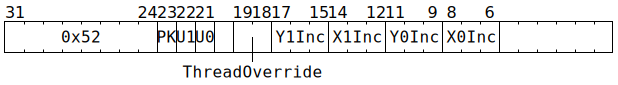

# `INCADCXY` (Increment some ADC X and Y counters)

**Summary:**

**Backend execution unit:** [Miscellaneous Unit](MiscellaneousUnit.md)

## Syntax

```c
TT_INCADCXY(((/* bool */ PK) << 2) +
            ((/* bool */ U1) << 1) +
              /* bool */ U0,
              /* u3 */ Y1Inc,
              /* u3 */ X1Inc,
              /* u3 */ Y0Inc,
              /* u3 */ X0Inc)
```

There is no syntax to specify `/* u2 */ ThreadOverride`; if a non-zero value is desired for this field, the raw encoding must be used.

## Encoding



## Functional model

```c
uint2_t WhichThread = ThreadOverride == 0 ? CurrentThread : ThreadOverride - 1;
if (U0) ApplyTo(ADCs[WhichThread].Unpacker[0]);
if (U1) ApplyTo(ADCs[WhichThread].Unpacker[1]);
if (PK) ApplyTo(ADCs[WhichThread].Packers);

void ApplyTo(ADC& ADC_) {
  ADC_.Channel[0].X += X0Inc;
  ADC_.Channel[0].Y += Y0Inc;
  ADC_.Channel[1].X += X1Inc;
  ADC_.Channel[1].Y += Y1Inc;
}
```
