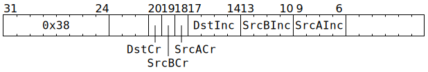

# `INCRWC` (Increment RWC SrcA / SrcB / Dst counters)

**Summary:**

**Backend execution unit:** [Matrix Unit (FPU)](MatrixUnit.md)

## Syntax

```c
TT_INCRWC(((/* bool */ DstCr) << 2) +
          ((/* bool */ SrcBCr) << 1) +
            /* bool */ SrcACr,
            /* u4 */ DstInc,
            /* u4 */ SrcBInc,
            /* u4 */ SrcAInc);
```

## Encoding



## Functional model

```c
auto& RWC = RWCs[CurrentThread];
if (SrcACr) {
  RWC.SrcA_Cr += SrcAInc;
  RWC.SrcA = RWC.SrcA_Cr;
} else {
  RWC.SrcA += SrcAInc;
}
if (SrcBCr) {
  RWC.SrcB_Cr += SrcBInc;
  RWC.SrcB = RWC.SrcB_Cr;
} else {
  RWC.SrcB += SrcBInc;
}
if (DstCr) {
  RWC.Dst_Cr += DstInc;
  RWC.Dst = RWC.Dst_Cr;
} else {
  RWC.Dst += DstInc;
}
```
