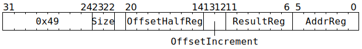

# `LOADIND` (L1 read to GPR)

**Summary:** Read between 8 and 128 bits from L1 to Tensix GPR(s). The instruction completes execution as soon as the read-request has been sent towards L1, at which point the thread's next instruction can execute.

If reading 8 bits, then the high 24 bits of the result GPR are left unchanged. If reading 16 bits, then the high 16 bits of the result GPR are left unchanged.

The L1 address is formed using a pair of GPRs, one of which can be incremented as part of the instruction.

**Backend execution unit:** [Scalar Unit (ThCon)](ScalarUnit.md)

## Syntax

```c
TT_LOADIND(/* u2 */ Size, /* u7 */ OffsetHalfReg, /* u2 */ OffsetIncrement, /* u6 */ ResultReg, /* u6 */ AddrReg)
```

## Encoding



## Functional model

The instruction is considered complete once the following happens:

```c
uint32_t* GPR = &GPRs[CurrentThread][ResultReg & (Size ? 0x3f : 0x3c)];
uint16_t* Offset = (char*)&GPRs[CurrentThread][0] + OffsetHalfReg * 2;
uint32_t L1Address = (GPRs[CurrentThread][AddrReg] * 16) + *Offset;
if (L1Address >= (1464*1024)) UndefinedBehaviour(); // Address must be in L1

switch (OffsetIncrement) {
case 0: *Offset += 0; break;
case 1: *Offset += 2; break;
case 2: *Offset += 4; break;
case 3: *Offset += 16; break;
}
```

The values from the above are captured, and then at some later point in time, the following happens:

```c
switch (Size) {
case 0: memcpy(GPR, (void*)(L1Address & ~15), 16); break; // Four consecutive GPRs
case 1: *GPR = *(uint32_t*)(L1Address & ~3); break;
case 2: *(uint16_t*)GPR = *(uint16_t*)(L1Address & ~1); break; // Low 16 bits of GPR
case 3: *(uint8_t*)GPR = *(uint8_t*)L1Address; break; // Low 8 bits of GPR
}
```

## Instruction scheduling

Various mechanisms exist to wait for the read to have completed, including [`STALLWAIT`](STALLWAIT.md) (with condition bit C0), [`FLUSHDMA`](FLUSHDMA.md) (with condition bit C0), and [RISCV TTSync](../BabyRISCV/TTSync.md). In _most_ cases it also suffices to just let some cycles elapse, for example by issuing seven [`DMANOP`](DMANOP.md) instructions after `LOADIND`, though such an approach is inherently racy.

## Performance

The instruction occupies the Scalar Unit (ThCon) for at least three cycles, possibly longer if the memory subsystem is busy.
