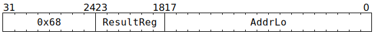

# `LOADREG` (MMIO register read to GPR)

**Summary:** Read 32 bits from a small window of the MMIO address space, placing the result in to a Tensix GPR. The instruction completes execution as soon as the read-request has been sent towards the MMIO device, at which point the thread's next instruction can execute.

**Backend execution unit:** [Scalar Unit (ThCon)](ScalarUnit.md)

## Syntax

```c
TT_LOADREG(/* u6 */ ResultReg, /* u18 */ AddrLo)
```

## Encoding



## Functional model

The instruction is considered complete once the following happens:

```c
uint32_t* GPR = &GPRs[CurrentThread][ResultReg];
uint32_t* Addr = 0xFFB00000 + (AddrLo << 2);
if (uintptr_t(Addr) < 0xFFB11000) {
  UndefinedBehaviour();
}
```

See the [memory map](../BabyRISCV/README.md#memory-map) for details of what exists within the `0xFFB_____` range. The values from the above are captured, and then at some later point in time, the following happens:

```c
*GPR = *Addr;
```

## Instruction scheduling

Various mechanisms exist to wait for the read to have completed, including [`STALLWAIT`](STALLWAIT.md) (with condition bit C0), [`FLUSHDMA`](FLUSHDMA.md) (with condition bit C0), and [RISCV TTSync](../BabyRISCV/TTSync.md). In _most_ cases it also suffices to just let some cycles elapse, for example by issuing seven [`DMANOP`](DMANOP.md) instructions after `LOADREG`, though such an approach is inherently racy.

## Performance

The instruction occupies the Scalar Unit (ThCon) for at least three cycles, possibly longer if the memory subsystem is busy.
