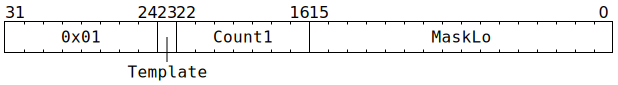

# `MOP` (Execute pre-programmed macro-op sequence)

**Summary:** The MOP Expander removes this instruction from the instruction stream, and replaces it with a different sequence of up to 32639 instructions. The sequence is based on one of two possible templates; template 0 uses a mixture of pre-programmed configuration and `Count1` and `MaskLo`, whereas template 1 exclusively uses pre-programmed configuration. RISCV B cannot use this instruction, as the point where it pushes instructions is after the MOP Expander.

**Frontend execution unit:** [MOP Expander](MOPExpander.md)

## Syntax

```c
TT_MOP(/* u1 */ Template, /* u7 */ Count1, /* u16 */ MaskLo)
```

## Encoding



## Functional model

See [MOP Expander's functional model](MOPExpander.md#functional-model).
