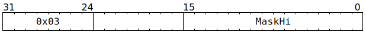

# `MOP_CFG` (Provide 16 bits of configuration for next `MOP`)

**Summary:** [`MOP`](MOP.md) instructions using template 0 usually want to specify a 32-bit mask, but the `MOP` instruction only has space for 16 bits of the mask. `MOP_CFG` is used prior to such a `MOP` to specify the high 16 bits of the mask.

**Frontend execution unit:** [MOP Expander](MOPExpander.md)

## Syntax

```c
TT_MOP_CFG(/* u16 */ MaskHi)
```

## Encoding



## Functional model

See [MOP Expander's functional model](MOPExpander.md#functional-model).
