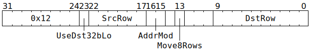

# `MOVA2D` (Move one row or eight rows from `SrcA` to `Dst`)

**Summary:** Move one row of datums from `SrcA` to `Dst`, or move an aligned block of eight rows of datums from `SrcA` to `Dst`. To bridge the gap between [`SrcA` data types](SrcASrcB.md#data-types) and [`Dst` data types](Dst.md#data-types), TF32 / BF16 in `SrcA` can be converted to FP32 in `Dst`, and any of BF16 / FP16 / Integer "8" in `SrcA` can be passed through unchanged to `Dst`. If used with care, software can also use a pair of `MOVA2D` instructions to lanewise combine two spans of 16-bit data in `SrcA` to form a single span of 32-bit data in `Dst`.

**Backend execution unit:** [Matrix Unit (FPU)](MatrixUnit.md)

## Syntax

```c
TT_MOVA2D(/* bool */ UseDst32bLo,
          /* u6 */ SrcRow,
          /* u2 */ AddrMod,
         (/* bool */ Move8Rows) << 1,
          /* u10 */ DstRow)
```

## Encoding



## Functional model

This instruction will, if neccessary, spend time waiting at the Wait Gate before being dispatched to the Matrix Unit (FPU):

```c
while (SrcA[MatrixUnit.SrcABank].AllowedClient != MatrixUnit) {
  wait;
}
```

Once dispatched to the Matrix Unit (FPU):
```c
uint1_t StateID = ThreadConfig[CurrentThread].CFG_STATE_ID_StateID;
auto& ConfigState = Config[StateID];

// Determine the data formats.
uint4_t SrcAFmt = ConfigState.ALU_FORMAT_SPEC_REG_SrcA_override ? ConfigState.ALU_FORMAT_SPEC_REG_SrcA_val : ConfigState.ALU_FORMAT_SPEC_REG0_SrcA;
bool Use8bExponent;
if (ThreadConfig[CurrentThread].FP16A_FORCE_Enable) {
  Use8bExponent = false;
} else if (SrcAFmt in {FP32, TF32, BF16, BFP8, BFP4, BFP2, INT32, INT16}) {
  Use8bExponent = true;
} else {
  Use8bExponent = false;
}
bool FlushDenormals = !ConfigState.ALU_ACC_CTRL_Zero_Flag_disabled_src;

// Determine the row range.
unsigned NumRows;
DstRow += ThreadConfig[CurrentThread].DEST_TARGET_REG_CFG_MATH_Offset;
DstRow += RWCs[CurrentThread].Dst + ConfigState.DEST_REGW_BASE_Base;
SrcRow += RWCs[CurrentThread].SrcA;
if (Move8Rows) {
  NumRows = 8;
  DstRow &= 0x3f8;
  SrcRow &= 0x38;
} else {
  NumRows = 1;
  DstRow &= 0x3ff;
  SrcRow &= 0x3f;
}

// Actually copy the row(s).
for (; NumRows; --NumRows, ++DstRow, ++SrcRow) {
  for (unsigned Column = 0; Column < 16; ++Column) {
    if (LaneConfig[Column / 2].BLOCK_DEST_MOV.Bit[Column & 1]) continue;
    uint19_t SrcAVal = SrcA[MatrixUnit.SrcABank][SrcRow][Column];
    if (FlushDenormals && !(SrcAVal & 0xff)) SrcAVal = 0;
    uint16_t Val16b = Use8bExponent ? RemoveLowMantissa(SrcAVal) : RemoveHighExponent(SrcAVal);
    if (SrcAFmt == TF32) {
      uint16_t LowMantissa = ((SrcAVal >> 8) & 7) << 13; // The bits removed by RemoveLowMantissa.
      if (UseDst32bLo) {
        // This is unlikely to be useful.
        LowMantissa |= Val16b;
      }
      // Dst holds TF32 as Sign,HiMan(7b),Exp(8b),LoMan(3b),Zeros(13b)
      // This is compatible with Dst FP32, where Zeros extends LoMan. 
      Dst32b[DstRow][Column] = (uint32_t(Val16b) << 16) | LowMantissa;
    } else if (UseDst32bLo) {
      // This is unlikely to be useful, unless software is deliberately
      // packing two bf16 or fp16 values in to 32 bits and storing them in Dst32b.
      // To store a pair of 16b values, first use MOVA2D with SrcAFmt=TF32 to
      // store the high 16b, then use MOVA2D with SrcAFmt!=TF32 and
      // UseDst32bLo=true to store the low 16b. If the first MOVA2D uses any other
      // SrcAFmt, then a mixture of Dst16b and Dst32b accesses will occur, which
      // can be made to work, but software needs to really know what it is doing.
      Dst32b[DstRow][Column] = (Dst32b[DstRow][Column] & 0xffff0000) | Val16b;
    } else {
      // Dst holds BF16 as Sign,Man(7b),Exp(8b)
      // Dst holds FP16 as Sign,Man(10b),Exp(5b)
      Dst16b[DstRow][Column] = Val16b;
    }
  }
}

// Advance the RWCs.
ApplyAddrMod(AddrMod);
```

Supporting definitions:
```c
uint16_t RemoveLowMantissa(uint19_t x) {
  // Input is Sign,Man(10b),Exp(8b)
  // Output is Sign,Man(7b),Exp(8b) with Man taken from high 7b of input Man

  // It is expected that the input will be Src-style BF16, and therefore that
  // the low 3b of the input Man is zero. The output is Dst-style BF16. If
  // the input is instead Src-style TF32, then the low three bits of mantissa
  // are discarded, but there is a MOVA2D code path which can later reattach
  // these low three bits to form a Dst-style FP32/TF32.

  uint19_t Sign = x & (1 << 19);
  uint19_t ManHi = x & (0xff << 11);
  uint19_t Exp = x & 0xff;
  return (Sign >> 3) | (ManHi >> 3) | Exp;
}

uint16_t RemoveHighExponent(uint19_t x) {
  // Input is Sign,Man(10b),Exp(8b)
  // Output is Sign,Man(10b),Exp(5b) with Exp taken from low 5b of input Exp

  // It is expected that the input will be Src-style FP16, and therefore that
  // the high 3b of the input Exp is zero. The output is Dst-style FP16.

  uint19_t Sign = x & (1 << 19);
  uint19_t Man = x & (0x3ff << 8);
  uint19_t ExpLo = x & 0x1f;
  return (Sign >> 3) | (Man >> 3) | ExpLo;
}
```

## Instruction scheduling

If `MOVA2D` is used, then for the next three cycles, software should avoid reading from the region of `Dst` which was written to. To partially enforce this, if a thread presents an instruction from the following list (regardless of where in `Dst` it might access), hardware will automatically stall the thread for an appropriate number of cycles: `MOVD2A`, `MOVD2B`, `ELWMUL`, `MVMUL`, `DOTPV`, `GMPOOL`, `GAPOOL`, `MFCONV3S1`, `CONV3S1`, `MPOOL3S1`, `APOOL3S1`, `CONV3S2`, `MPOOL3S2`, `APOOL3S2`.
