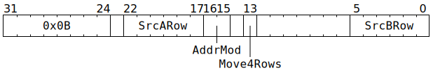

# `MOVB2A` (Move one row or four rows from `SrcB` to `SrcA`)

**Summary:** Move one row of datums from `SrcB` to `SrcA`, or move an aligned block of four rows of datums from `SrcB` to `SrcA`.

**Backend execution unit:** [Matrix Unit (FPU)](MatrixUnit.md)

## Syntax

```c
TT_MOVB2A(/* u6 */ SrcARow,
          /* u2 */ AddrMod,
         (/* bool */ Move4Rows) << 1,
          /* u6 */ SrcBRow)
```

## Encoding



## Functional model

This instruction will, if necessary, spend time waiting at the Wait Gate before being dispatched to the Matrix Unit (FPU):

```c
while (SrcB[MatrixUnit.SrcBBank].AllowedClient != MatrixUnit) {
  wait;
}
```

Once dispatched to the Matrix Unit (FPU):
```c
uint1_t StateID = ThreadConfig[CurrentThread].CFG_STATE_ID_StateID;
auto& ConfigState = Config[StateID];
bool FlushDenormals = !ConfigState.ALU_ACC_CTRL_Zero_Flag_disabled_src;

// Determine the row range.
unsigned NumRows;
SrcARow += RWCs[CurrentThread].SrcA;
SrcBRow += RWCs[CurrentThread].SrcB;
if (Move4Rows) {
  NumRows = 4;
  SrcARow &= 0x3c;
  SrcBRow &= 0x3c;
} else {
  NumRows = 1;
  SrcARow &= 0x3f;
  SrcBRow &= 0x3f;
}

// Actually copy the row(s).
for (; NumRows; --NumRows, ++SrcARow, ++SrcBRow) {
  for (unsigned Column = 0; Column < 16; ++Column) {
    if (LaneConfig[Column / 2].BLOCK_DEST_MOV.Bit[Column & 1]) continue;
    uint19_t SrcVal = SrcB[MatrixUnit.SrcBBank][SrcBRow][Column];
    if (FlushDenormals && !(SrcVal & 0xff)) SrcVal = 0;
    SrcA[MatrixUnit.SrcABank][SrcARow][Column] = SrcVal;
  }
}

// Advance the RWCs.
ApplyAddrMod(AddrMod);
```

## Instruction scheduling

`MOVB2A` does not automatically wait at the Wait Gate to ensure that `SrcA[MatrixUnit.SrcABank].AllowedClient == SrcClient::MatrixUnit`, so software may wish to use [`STALLWAIT`](STALLWAIT.md) (with block bit B6 and condition code C10) prior to `MOVB2A`.

If `MOVB2A` is used, then on the next cycle, the only instructions that the Matrix Unit (FPU) can accept are `MOVD2A` and `MOVB2A`. If a thread presents any other Matrix Unit (FPU) instruction, then hardware will automatically stall the thread for one cycle.
