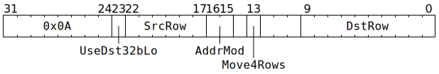

# `MOVD2B` (Move one row or four rows from `Dst` to `SrcB`)

**Summary:** Move one row of datums from `Dst` to `SrcB`, or move an aligned block of four rows of datums from `Dst` to `SrcB`. To bridge the gap between [`Dst` data types](Dst.md#data-types) and [`SrcB` data types](SrcASrcB.md#data-types), either of FP32 / BF16 in `Dst` can be converted to either of TF32 / BF16 in `SrcB`, and either of FP16 / Integer "8" in `Dst` can be passed through unchanged to `SrcB`. If used with care, software can also take 32-bit data in `Dst` and move either the low or high bits of each datum to `SrcB`.

**Backend execution unit:** [Matrix Unit (FPU)](MatrixUnit.md)

## Syntax

```c
TT_MOVD2B(/* bool */ UseDst32bLo,
          /* u6 */ SrcRow,
          /* u2 */ AddrMod,
         (/* bool */ Move4Rows) << 1,
          /* u10 */ DstRow)
```

## Encoding



## Functional model

```c
uint1_t StateID = ThreadConfig[CurrentThread].CFG_STATE_ID_StateID;
auto& ConfigState = Config[StateID];

// Determine the data formats.
bool UseDst32b;
uint4_t SrcBStyle;
if (ThreadConfig[CurrentThread].FP16A_FORCE_Enable) {
  UseDst32b = false;
  SrcBStyle = FP16;
} else {
  // This is not a documentation typo; SrcAFmt really is used to determine SrcBStyle.
  uint4_t SrcAFmt = ConfigState.ALU_FORMAT_SPEC_REG_SrcA_override ? ConfigState.ALU_FORMAT_SPEC_REG_SrcA_val : ConfigState.ALU_FORMAT_SPEC_REG0_SrcA;
  UseDst32b = ConfigState.ALU_ACC_CTRL_Fp32_enabled || ConfigState.ALU_ACC_CTRL_INT8_math_enabled;
  if (SrcAFmt in {FP32, BF16, BFP8, BFP4, BFP2, INT32, INT16}) {
    SrcBStyle = BF16;
  } else if (SrcAFmt in {FP16, FP8, BFP8a, BFP4a, BFP2a, INT8}) {
    SrcBStyle = FP16;
  } else /* SrcAFmt == TF32 */ {
    SrcBStyle = TF32;
  }
}

// Determine the row range.
unsigned NumRows;
DstRow += ThreadConfig[CurrentThread].DEST_TARGET_REG_CFG_MATH_Offset;
DstRow += RWCs[CurrentThread].Dst + ConfigState.DEST_REGW_BASE_Base;
SrcRow += RWCs[CurrentThread].SrcB;
if (Move4Rows) {
  NumRows = 4;
  DstRow &= 0x3fc;
  SrcRow &= 0x3c;
} else {
  NumRows = 1;
  DstRow &= 0x3ff;
  SrcRow &= 0x3f;
}

// Actually copy the row(s).
for (; NumRows; --NumRows, ++DstRow, ++SrcRow) {
  for (unsigned Column = 0; Column < 16; ++Column) {
    uint19_t SrcBVal;
    if (UseDst32b) {
      // Read from Dst in 32-bit mode.
      uint32_t DstVal = Dst32b[DstRow][Column];
      if (UseDst32bLo) {
        // This is unlikely to be useful, unless software has deliberately
        // packed two bf16 or fp16 values in to 32 bits and written them to Dst32b.
        DstVal = (DstVal << 16) | (DstVal & 0xffff);
      }
      if (SrcBStyle == BF16) {
        // Treat DstVal as fp32 or tf32, truncate to bf16.
        SrcBVal = ShuffleBF16(DstVal >> 16);
      } else if (SrcBStyle == FP16) {
        // This is unlikely to be useful, unless software has deliberately
        // packed two fp16 values in to 32 bits and written them to Dst32b.
        SrcBVal = ShuffleFP16(DstVal >> 16);
      } else if (!UseDst32bLo) {
        // Treat DstVal as fp32 or tf32, truncate to tf32.
        SrcBVal = ShuffleTF32(DstVal >> 13);
      } else {
        // This gives the 13 bits which are discarded by the fp32 -> tf32 conversion
        // in the above branch, but they're unlikely to be useful for anything other
        // than a subsequent MOVA2D with UseDst32bLo=true.
        SrcBVal = DstVal & 0x1fff;
      }
    } else {
      // Read from Dst in 16-bit mode.
      uint16_t DstVal = Dst16b[DstRow][Column];
      if (UseDst32bLo) {
        // DstVal isn't wide enough to contain 32-bit data.
        UndefinedBehaviour();
      }
      if (SrcBStyle == BF16) {
        // Treat DstVal as bf16.
        SrcBVal = ShuffleBF16(DstVal);
      } else if (SrcBStyle == FP16) {
        // Treat DstVal as fp16.
        // This branch also applies to "integer 8" data, as it is overlaid on to fp16.
        SrcBVal = ShuffleFP16(DstVal);
      } else {
        // DstVal isn't wide enough to contain fp32 or tf32 data.
        UndefinedBehaviour();
      }
    }
    SrcB[MatrixUnit.SrcABank][SrcRow][Column] = SrcBVal;
  }
}

// Advance the RWCs.
ApplyAddrMod(AddrMod);
```

Supporting definitions:
```c
uint19_t ShuffleBF16(uint16_t x) {
  // Dst holds BF16 as Sign,Man(7b),Exp(8b)
  // Src holds BF16 as Sign,Man(10b),Exp(8b)
  return ((x & 0xFF00) << 3) | (x & 0xFF);
}

uint19_t ShuffleFP16(uint16_t x) {
  // Dst holds FP16 as Sign,Man(10b),Exp(5b)
  // Src holds FP16 as Sign,Man(10b),Zero(3b),Exp(5b)
  return ((x & 0xFFE0) << 3) | (x & 0x1F);
}

uint19_t ShuffleTF32(uint19_t x) {
  // Dst holds TF32 as Sign,HiMan(7b),Exp(8b),LoMan(3b)
  // Src holds TF32 as Sign,Man(10b),Exp(8b)
  uint19_t SignHiMan = x & 0x3fc000;
  uint19_t Exp       = x & 0x0007f8;
  uint19_t LoMan     = x & 0x000007;
  return SignHiMan | (LoMan << 8) | (Exp >> 3);
}
```

## Instruction scheduling

`MOVD2B` does not automatically wait at the Wait Gate to ensure that `SrcB[MatrixUnit.SrcBBank].AllowedClient == SrcClient::MatrixUnit`, so software may wish to use [`STALLWAIT`](STALLWAIT.md) (with block bit B6 and condition code C11) prior to `MOVD2B`.

If `MOVD2B` is used, then during the next three cycles, the only instruction that the Matrix Unit (FPU) can accept is another `MOVD2B`. If a thread presents any other Matrix Unit (FPU) instruction, then hardware will automatically stall the thread for an appropriate number of cycles.
