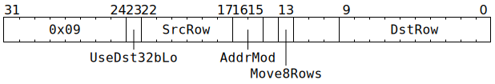

# `MOVDBGA2D` (Move one row or eight rows from `SrcA` to `Dst`)

**Summary:** This instruction is identical to [`MOVA2D`](MOVA2D.md), except that it doesn't _automatically_ wait for `SrcA[MatrixUnit.SrcABank].AllowedClient == MatrixUnit`.

**Backend execution unit:** [Matrix Unit (FPU)](MatrixUnit.md)

## Syntax

```c
TT_MOVDBGA2D(/* bool */ UseDst32bLo,
             /* u6 */ SrcRow,
             /* u2 */ AddrMod,
            (/* bool */ Move8Rows) << 1,
             /* u10 */ DstRow)
```

## Encoding



## Functional model

See [`MOVA2D`'s functional model](MOVA2D.md#functional-model), ignoring the paragraph about the Wait Gate.
