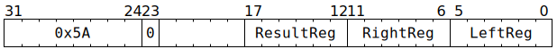

# `MULDMAREG` (Perform 16b↦32b unsigned multiplication on GPRs)

**Summary:** Performs unsigned multiplication between two Tensix GPRs, or between a Tensix GPR and an unsigned 6-bit immediate. Only the low 16 bits of each input are used, and then the result is the full 32-bit unsigned product.

**Backend execution unit:** [Scalar Unit (ThCon)](ScalarUnit.md)

## Syntax

```c
TT_MULDMAREG(0, /* u6 */ ResultReg, /* u6 */ RightReg , /* u6 */ LeftReg)
TT_MULDMAREG(1, /* u6 */ ResultReg, /* u6 */ RightImm6, /* u6 */ LeftReg)
```

## Encoding




## Functional model

```c
uint32_t LeftVal = GPRs[CurrentThread][LeftReg];
uint32_t RightVal = GPRs[CurrentThread][RightReg]; // RightReg  variant
uint32_t RightVal = RightImm6;                     // RightImm6 variant
uint32_t ResultVal = (LeftVal & 0xFFFFu) * (RightVal & 0xFFFFu);
GPRs[CurrentThread][ResultReg] = ResultVal;
```

## Performance

The `RightImm6` variant takes three cycles. The `RightReg` variant takes three cycles if `LeftReg` and `RightReg` come from the same aligned group of four GPRs, or four cycles otherwise.
