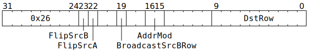

# `MVMUL` (`Dst += SrcB @ SrcA` matrix multiply)

**Summary:** An aligned 8x16 matrix from [`SrcB`](SrcASrcB.md) is multiplied with an aligned 16x16 matrix from [`SrcA`](SrcASrcB.md), and the resultant 8x16 matrix added element-wise to an aligned 8x16 block of [`Dst`](Dst.md). The hardware multipliers consume at most 5 bits of `SrcA` magnitude/mantissa and at most 7 bits of `SrcB` magnitude/mantissa, so software may wish to execute up to four separate fidelity phases, subject to the precision of the input data and the desired output precision. To get the effect of `Dst = SrcB @ SrcA` (i.e. `=` rather than `+=`), [`ZEROACC`](ZEROACC.md) can be used prior to `MVMUL`, as `MVMUL` reads undefined rows as zero.

The supported data type combinations are:

|[`Dst` data type](Dst.md#data-types)|+=|[`SrcB` data type](SrcASrcB.md#data-types)|@|[`SrcA` data type](SrcASrcB.md#data-types)|
|---|---|---|---|---|
|8x16 matrix of either FP32 or BF16|+=|8x16 matrix of either TF32 or BF16|@|16x16 matrix of either TF32 (†) or BF16|
|8x16 matrix of either FP32 or FP16|+=|8x16 matrix of FP16|@|16x16 matrix of FP16 (†)|
|8x16 matrix of integer "32"|+=|8x16 matrix of integer "8"|@|16x16 matrix of integer "8" (‡)|

(†) For `SrcA`, the least significant bit of the FP16 or TF32 mantissa is ignored in multiplication operations.

(‡) For `SrcA`, the most significant two bits of the integer "8" magnitude are ignored in multiplication operations, leaving just the low eight bits of magnitude. The usable values are therefore -255 through +255.

There is also support for broadcasting a 1x16 row of `SrcB`, albeit in a slightly odd way: it'll be broadcasted up to a 7x16 matrix, and then half the rows set to zero, multiplied with a 16x16 matrix from `SrcA` as per usual, and added to a 7x16 matrix in `Dst`. Equivalently, this can be seen as starting with a 1x16 row, multiplying it with a 16x16 matrix, then doing the exotic broadcast and zeroing, then adding to `Dst`. If this mode is used, the data movement pattern is:


**Backend execution unit:** [Matrix Unit (FPU)](MatrixUnit.md)

## Syntax

```c
TT_MVMUL(((/* bool */ FlipSrcB) << 1) +
           /* bool */ FlipSrcA,
           /* bool */ BroadcastSrcBRow,
           /* u2 */ AddrMod,
           /* u10 */ DstRow)
```

## Encoding



## Functional model

This instruction will, if necessary, spend time waiting at the Wait Gate before being dispatched to the Matrix Unit (FPU):

```c
while (SrcA[MatrixUnit.SrcABank].AllowedClient != MatrixUnit
    || SrcB[MatrixUnit.SrcBBank].AllowedClient != MatrixUnit) {
  wait;
}
```

Once dispatched to the Matrix Unit (FPU):
```c
uint1_t StateID = ThreadConfig[CurrentThread].CFG_STATE_ID_StateID;
auto& ConfigState = Config[StateID];

// Determine the data formats.
uint4_t SrcAStyle;
bool UseDst32b;
if (ThreadConfig[CurrentThread].FP16A_FORCE_Enable) {
  SrcAStyle = FP16;
  UseDst32b = false;
} else if (ConfigState.ALU_ACC_CTRL_INT8_math_enabled) {
  SrcAStyle = INT8;
  UseDst32b = true;
} else {
  uint4_t SrcAFmt = ConfigState.ALU_FORMAT_SPEC_REG_SrcA_override ? ConfigState.ALU_FORMAT_SPEC_REG_SrcA_val : ConfigState.ALU_FORMAT_SPEC_REG0_SrcA;
  if (SrcAFmt in {FP32, BF16, BFP8, BFP4, BFP2, INT32, INT16}) {
    SrcAStyle = BF16;
  } else if (SrcAFmt in {FP16, FP8, BFP8a, BFP4a, BFP2a, INT8}) {
    SrcAStyle = FP16;
  } else /* SrcAFmt == TF32 */ {
    SrcAStyle = TF32;
  }
  UseDst32b = ConfigState.ALU_ACC_CTRL_Fp32_enabled;
}

// Determine the row range.
unsigned NumRows = BroadcastSrcBRow ? 7 : 8;
uint6_t SrcARow = RWCs[CurrentThread].SrcA & 0x38;
uint6_t SrcBRow = RWCs[CurrentThread].SrcB & (BroadcastSrcBRow ? 0x3f : 0x38);
DstRow += ThreadConfig[CurrentThread].DEST_TARGET_REG_CFG_MATH_Offset;
DstRow += RWCs[CurrentThread].Dst + ConfigState.DEST_REGW_BASE_Base;
DstRow &= (0x400 - NumRows);

// Determine the fidelity phase.
uint2_t FidelityPhase = RWCs[CurrentThread].FidelityPhase;
FidelityPhase += ThreadConfig[CurrentThread].FIDELITY_BASE_Phase;
FidelityPhase &= 3;

// Extract the input matrices and compute their matrix product.
union {int32_t i; float f} SrcBMatrix[NumRows][16], SrcAMatrix[16][16], Multiplied[NumRows][16];

for (unsigned i = 0; i < NumRows; ++i) {
  for (unsigned j = 0; j < 16; ++j) {
    uint19_t SrcBVal = SrcB[MatrixUnit.SrcBBank][SrcBRow + (BroadcastSrcBRow ? 0 : i)][j];
    switch (SrcAStyle) {
    case INT8: SrcBMatrix[i][j].i = ReadSrcInt8(SrcBVal & (FidelityPhase & 2 ? 0x40fff : 0x7f0ff)); break;
    case BF16: SrcBMatrix[i][j].f = SrcBFidelityBits(ReadBF16(SrcBVal), FidelityPhase); break;
    case FP16: SrcBMatrix[i][j].f = SrcBFidelityBits(ReadFP16(SrcBVal), FidelityPhase); break;
    case TF32: SrcBMatrix[i][j].f = SrcBFidelityBits(ReadTF32(SrcBVal), FidelityPhase); break;
    }
  }
}

for (unsigned i = 0; i < 16; ++i) {
  for (unsigned j = 0; j < 16; ++j) {
    uint19_t SrcAVal = SrcA[MatrixUnit.SrcABank][SrcARow + i][j];
    switch (SrcAStyle) {
    case INT8: SrcAMatrix[i][j].i = ReadSrcInt8(SrcAVal & (FidelityPhase & 1 ? 0x41fff : 0x4e0ff)); break;
    case BF16: SrcAMatrix[i][j].f = SrcAFidelityBits(ReadBF16(SrcAVal), FidelityPhase); break;
    case FP16: SrcAMatrix[i][j].f = SrcAFidelityBits(ReadFP16(SrcAVal), FidelityPhase); break;
    case TF32: SrcAMatrix[i][j].f = SrcAFidelityBits(ReadTF32(SrcAVal), FidelityPhase); break;
    }
  }
}

for (unsigned i = 0; i < NumRows; ++i) {
  for (unsigned j = 0; j < 16; ++j) {
    if (SrcAStyle == INT8) {
      int32_t x = 0;
      for (unsigned k = 0; k < 16; ++k) {
        x += SrcBMatrix[i][k].i * SrcAMatrix[k][j].i;
      }
      Multiplied[i][j].i = x;
    } else {
      float x = 0;
      for (unsigned k = 0; k < 16; ++k) {
        x += SrcBMatrix[i][k].f * SrcAMatrix[k][j].f;
      }
      Multiplied[i][j].f = x;
    }
  }
}

// Add the matrix product to Dst.
for (unsigned i = 0; i < NumRows; i += BroadcastSrcBRow ? 2 : 1) {
  for (unsigned j = 0; j < 16; ++j) {
    if (SrcAStyle == INT8) {
      int32_t x = Multiplied[i][j].i;
      x = SaturateAddInt32(x, ReadDstInt32(Dst32b[DstRow + i][j]));
      Dst32b[DstRow + i][j] = WriteDstInt32(x);
    } else {
      float x = Multiplied[i][j].f;
      if (UseDst32b) {
        // Dst is FP32, regardless of SrcAStyle.
        x += ReadDstFP32(Dst32b[DstRow + i][j]);
        Dst32b[DstRow + i][j] = WriteDstFP32(x);
      } else if (SrcAStyle == FP16) {
        // Dst is FP16, just like SrcAStyle.
        x += ReadDstFP16(Dst16b[DstRow + i][j]);
        Dst16b[DstRow + i][j] = WriteDstFP16(RoundToFP16(x));
      } else {
        // Dst is BF16 (SrcAStyle is either BF16 or TF32).
        x += ReadDstBF16(Dst16b[DstRow + i][j]);
        Dst16b[DstRow + i][j] = WriteDstBF16(RoundToBF16(x));
      }
    }
  }
}

// Possibly flip source banks.
if (FlipSrcA) {
  if (!ThreadConfig[CurrentThread].CLR_DVALID_SrcA_Disable) {
    SrcA[MatrixUnit.SrcABank].AllowedClient = SrcClient::Unpackers;
  }
  MatrixUnit.SrcABank ^= 1;
}
if (FlipSrcB) {
  if (!ThreadConfig[CurrentThread].CLR_DVALID_SrcB_Disable) {
    SrcB[MatrixUnit.SrcBBank].AllowedClient = SrcClient::Unpackers;
  }
  MatrixUnit.SrcBBank ^= 1;
}

// Advance the RWCs.
ApplyAddrMod(AddrMod);
```

For floating-point computation, the functional model should be taken as a rough guide rather than an exact description: operations might be performed in a different order to that shown, various operations might be fused together, and precision could be either lower or higher than what is shown. Denormals will be flushed to zero, and handling of NaN/infinity does _not_ conform to IEEE754.

The supporting definitions of `ReadSrcInt8`, `SrcAFidelityBits`, `SrcBFidelityBits`, `ReadBF16`, `ReadFP16`, `ReadTF32`, `SaturateAddInt32`, `ReadDstInt32`, `WriteDstInt32`, `ReadDstFP32`, `WriteDstFP32`, `ReadDstFP16`, `RoundToFP16`, `WriteDstFP16`, `ReadDstBF16`, `RoundToBF16`, and `WriteDstBF16` are the same as for [`ELWMUL`](ELWMUL.md#functional-model) and can be found there.
