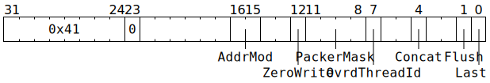

# `PACR` (Move datums from `Dst` to L1)

**Summary:** Issue work to between one and four packers, where each packer will move some number of datums from `Dst` to a contiguous range of L1, possibly performing some minor data transformations in the process.

**Backend execution unit:** [Packers](Packers/README.md)

## Syntax

```c
TT_PACR(/* u2 */ AddrMod, /* bool */ ZeroWrite, /* u4 */ PackerMask,
        /* bool */ OvrdThreadId, /* bool */ Concat, /* bool */ Flush,
        /* bool */ Last)
```

## Encoding



## Functional model

The `PackerMask` field determines which of the four packers are being instructed:

|`PackerMask`|Behaviour|
|---|---|
|`0b0000`|Issue work to packer 0 (i.e. as a special case, `0b0000` is rewritten to `0b0001`)|
|`0b0001`|Issue work to packer 0|
|`0b0010`|Issue work to packer 1|
|`0b0100`|Issue work to packer 2|
|`0b1000`|Issue work to packer 3|
|`0b0011`|Issue work to packers 0 and 1|
|`0b1100`|Issue work to packers 2 and 3|
|`0b1111`|Issue work to all four packers|
|Any other value|Undefined; will issue work to _at least_ one of the packers in the mask, but other bits of the mask _might_ be ignored|

The issued work will start at the packers' [input address generator](Packers/InputAddressGenerator.md), work through the various [packer pipeline stages](Packers/README.md), and eventually reach the [output address generator](Packers/OutputAddressGenerator.md). The fields of the instruction are used at various stages:
* `AddrMod`: used by the input address generator and the output address generator to manipulate ADC Y/Z values in preparation for the _next_ `PACR` instruction.
* `ZeroWrite`: used by the input address generator (to fetch datums from `/dev/null` rather than `Dst`).
* `OvrdThreadId`: used by the input address generator and the output address generator to determine which ADC is in use.
* `Concat`: if [compression](Packers/Compression.md) is enabled, setting this to `true` causes the _next_ `PACR` instruction to continue the current compression row rather than starting a new compression row. If compression is disabled, then there is no inherent concept of compression row, and this field has no effect.
* `Flush`: used by the input address generator (overrides `InputNumDatums` to zero) and the output address generator (flushes the output buffers sitting before L1 and causes the _next_ `PACR` instruction to start at fresh output addresses).
* `Last`: used by the output address generator (flushes the output buffers sitting before L1 and causes the _next_ `PACR` instruction to start at fresh output addresses).

A lot of [backend configuration fields](BackendConfiguration.md) are consumed by the various stages in the packer pipeline. Some of those fields are sampled when the `PACR` instruction starts, with that sampled value consistently used throughout the lifetime of the instruction. Other fields are sampled per-packer when _some_ `PACR` instruction starts: if there are multiple `PACR` instructions in-flight within a given packer, they will observe the value of these configuration fields as they were when _one_ of the in-flight instructions started. Finally, some fields are sampled at an unspecified point during the lifetime of a `PACR` instruction.
