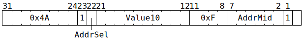

# `PACR_SETREG` (MMIO register write sequenced with PACR)

**Summary:** Once all previous `PACR` instructions have gotten past the packer's late format conversion stage, flush any data in the packer buffers just before L1 and simultaneously perform a 32-bit memory write within a small window of the MMIO address space.

**Backend execution unit:** [Packers](Packers/README.md)

## Syntax

```c
TT_PACR_SETREG(1, /* u1 */ AddrSel, /* u10 */ Value10, 0xf, /* u6 */ AddrMid, 1, 0)
```

## Encoding



## Functional model

Once all previous `PACR` instructions have gotten past the packer's late format conversion stage, the following happens:

```c
uint1_t StateID = ThreadConfig[CurrentThread].CFG_STATE_ID_StateID;
auto& Packer0Config = Packers[0].Config[StateID];
uint32_t Addr = 0xFFB00000 + Packers.SetRegBase[AddrSel] + (AddrMid << 12);
uint32_t ValueHi = Value10 * Packers.SetRegHiScaler[Packer0Config.Out_data_format & 3];
uint32_t Value32 = Value10 + ((ValueHi & 0x1ffff) << 12);
if (Addr < 0xFFB11000) {
  UndefinedBehaviour();
} else if (Addr < 0xFFB80000) {
  *Addr = Value32;
}
```

The `SetRegBase` and `SetRegHiScaler` fields are set via TDMA-RISC, rather than being traditional backend configuration. The value of `Packer0Config.Out_data_format` is sampled as the `PACR_SETREG` instruction starts, whereas the values of `SetRegBase` and `SetRegHiScaler` are sampled at some unspecified point in the evaluation of the instruction.

The bits of `Addr` will consist of 12 fixed bits (`0xFFB`), two bits from `SetRegBase`, six bits from `AddrMid`, ten more bits from `SetRegBase`, then two fixed bits (`0b00`). See the [memory map](../BabyRISCV/README.md#memory-map) for details of what exists within this range.
