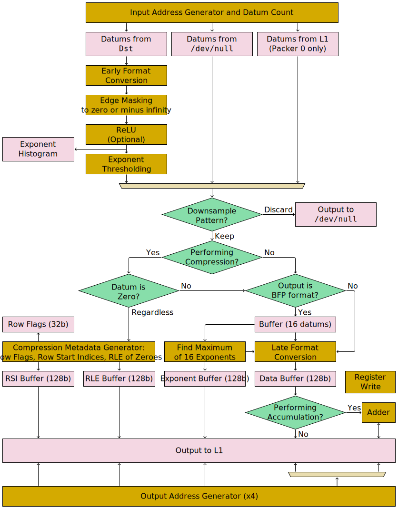

# Packers

There are four packers per Tensix Coprocessor. Each of the four packers has a pipeline which looks like:

In its most basic configuration, with all optional features disabled, each packer just moves [a contiguous range of datums from `Dst`](InputAddressGenerator.md) to [a contiguous range of L1](OutputAddressGenerator.md). Various optional features can then be added on:
* [Format conversions](FormatConversion.md) (early, or late, or both).
* [Edge masking](EdgeMasking.md), to replace some datums with zero or with -∞.
* [ReLU](ReLU.md), to replace negative datums with zero, and optionally also either clamp large datums or replace small datums with zero.
* [Exponent histogramming](ExponentHistogram.md), to determine the maximum exponent and exponent distribution of datums.
* [Exponent thresholding](ExponentThresholding.md), to replace values close to zero with zero.
* [Downsampling](Downsampling.md), to select a non-contiguous range of datums from `Dst`.
* [Compression](Compression.md), to allow data containing lots of zeroes to take up less space in L1 (though attempting to compress data which _doesn't_ contain lots of zeroes will instead cause it to take up _more_ space in L1).
* Accumulation, to perform `L1 += Datum` rather than `L1 = Datum`.

It is usually the case that all four packers are instructed at once, each one moving a distinct range of `Dst` to a distinct range of L1.

## Instructions

The [`PACR`](../PACR.md) instruction is used to give work to between one and four packers, or to flush the output buffers sitting just before L1. The [`PACR_SETREG`](../PACR_SETREG.md) instruction can be used to write to a small region of address space, with the write sequenced with other `PACR` / `PACR_SETREG` instructions: per the "Register Write" block in the pipeline diagram, the write will occur _after_ all earlier `PACR` instructions have completed all of their late format conversions. At most one of these instructions can be started per cycle. For both of these instructions, the issuing Tensix thread will be blocked until the packers referenced by the instruction have _accepted_ the work, and then the thread can proceed on to its next instruction. To wait for the packers to have finished the work, use `STALLWAIT`.
