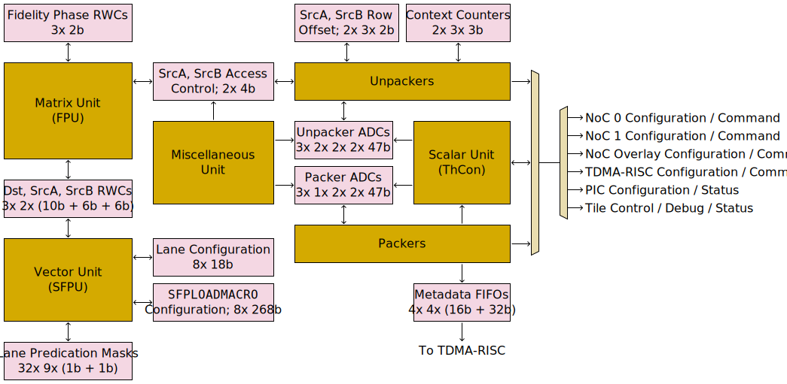

# Tensix Coprocessor

The Tensix Coprocessor is simultaneously executing instructions from three separate threads, at a rate of up to one instruction per thread per cycle. Instructions are _not_ pulled from memory - instead the Baby RISCV cores _push_ instructions to the three threads. The three threads are called Tensix T0 / Tensix T1 / Tensix T2, and in typical usage, RISCV T0 will be pushing instructions to Tensix T0, RISCV T1 will be pushing instructions to Tensix T1, and RISCV T2 will be pushing instructions to Tensix T2. Instructions are pushed by means of standard RISCV `sw` instructions to a special address in memory, though the RISCV cores also implement a custom extension allowing a store of a 32-bit immediate to that special memory address to be encoded as a single 32-bit RISCV instruction. In this way, it can appear as if Tensix instructions are mixed into the RISCV instruction stream.

The instruction set is entirely custom, and is extremely light on control flow, as complex control flow can be resolved by the RISCV cores prior to them pushing Tensix instructions. The frontend of the coprocessor is capable of _some_ control flow, and there are three separate copies of the frontend - one per thread. In contrast, the backend of the coprocessor is mostly shared between the three threads, though _some_ backend state is replicated three times in order to give each thread its own copy. Most notably, the majority of the FLOP/s come from the backend Matrix Unit (FPU), which can only start executing one instruction per cycle, regardless of how many threads are trying to use it. Accordingly, it is expected that while one thread is dispatching instructions to the Matrix Unit (FPU), another thread will be dispatching instructions to the Unpackers (to move data from L1 to where the Matrix Unit can use it), and the third thread will be dispatching instructions to the Packers (to move results of the Matrix Unit back to L1). This assignment of tasks to threads is not rigid; any thread can access any backend execution unit, but it has been found to be a useful software pattern.

Each Tensix instruction is 32 bits wide, but for some instructions, this does not give enough encoding space for all of the desired operands. As such, there are lots of configuration registers within the coprocessor, and instructions desiring more than 32 bits will take additional operands from particular configuration registers. Some of these configuration registers have three copies - one copy per thread. Others have two copies, with each thread able to choose which copy it wants to use at any given time. Particular Tensix instructions exist to help manipulate this configuration, and it is also mapped into the RISCV address space.

Once a RISCV core has pushed a Tensix instruction, execution of the RISCV core proceeds completely asynchronously to execution of the Tensix Coprocessor. The pushed instruction _will_ eventually be executed by the coprocessor, but if there are lots of other instructions queued up in front of it, the RISCV can get quite far ahead before the pushed instruction actually executes. This presents a common pitfall for programmers, if they expect the results of a Tensix instruction to be available to the very next RISCV instruction, or if they use a RISCV core to change configuration registers in anticipation of future instructions before past instructions using those same configuration registers have actually executed. Mechanisms exist to synchronize the RISCV cores and the Tensix Coprocessor, but software needs to explicitly use these mechanisms - it is not automatic.

## Block diagrams

First, a frontend-focused diagram, highlighting the major paths for instructions and configuration:

Meanwhile, a backend-focused diagram, highlighting the major paths for data flow between the various backend units:

Note that some L1 access ports are shared, and the full extent of sharing is not shown in the above diagram. Bank conflicts can also reduce the usable bandwidth in/out of L1. See the [L1](../L1.md) page for full details. Also note that the NoC data paths are not part of the backend; they are merely shown on the diagram for context.

Finally, the minor paths between the various backend units:

All three diagrams should be considered in unison to see the full scope of how the various units connect.

## Frontend

There are three copies of the frontend - one per thread. Each copy of the frontend has three major stages:
1. [The MOP Expander](MOPExpander.md)
2. [The Replay Expander](REPLAY.md)
3. The Wait Gate

The frontend is strictly in-order; instructions leave the frontend in the same order as RISCV cores push them into the frontend, and no re-ordering happens as instructions flow through the frontend. Once an instruction passes through the Wait Gate and enters a backend execution unit, re-ordering can start to occur, as all the backend units are processing in parallel, and each one can take a different number of cycles to process a given instruction. Software should use the Wait Gate to ensure that undesirable re-ordering does not happen.

The MOP Expander and the Replay Expander both serve a similar role: they can allow a single incoming instruction to expand to multiple outgoing instructions. Their usage is entirely optional, though their usage is strongly encouraged, as they mean that the backend can receive one instruction per thread per cycle without the need for a RISCV core to be pushing an instruction per thread per cycle. This frees up the RISCV cores to do other tasks, such as resolving control flow. If the expanders are in use, then the FIFOs between the frontend stages become particularly relevant: if an expander is busy outputting instructions, then subsequent incoming instructions will queue up in the FIFO until the expander has finished with the previous instruction. Once the FIFOs (and any shared buffers within the RISCV memory subsystem) are full, a RISCV core attempting to push an additional instruction will automatically stall until FIFO space becomes available, so the FIFO capacities serve as a limit on how far ahead RISCV execution can get.

There is a mux between the two expanders, allowing RISCV B to push instructions into the frontend. This feature should be used with extreme care, as if instructions from RISCV B and from RISCV Ti (or its MOP Expander) both try to pass through the mux on the same cycle, then the instruction from RISCV Ti (or its MOP Expander) will be silently discarded. Accordingly, software should ensure that RISCV B is only pushing instructions when RISCV Ti isn't.

At the end of each frontend is the Wait Gate, which controls flow of instructions out of the frontend and into the backend. As the name suggests, instructions can be forced to wait at the gate rather than passing through it. Because instructions leave the frontend in order, if one instruction is blocked waiting at the wait gate, then all the instructions behind it will also be waiting. This is another case where the FIFOs in the frontend become important: if an instruction is blocked waiting at the wait gate, then additional instructions can still be pushed, but only up until the FIFOs become full. Instructions can be forced to wait at the gate for one of several hardware-enforced reasons, or because of software issuing a `STALLWAIT` or `SEMWAIT` instruction.

## Backend

Once instructions pass through the Wait Gate in the frontend, they'll be dispatched to one of nine different backend execution units:
1. [Sync Unit](SyncUnit.md)
2. [Unpackers](Unpackers/README.md)
3. [Matrix Unit (FPU)](MatrixUnit.md)
4. [Packers](Packers/README.md)
5. [Vector Unit (SFPU)](VectorUnit.md)
6. [Scalar Unit (ThCon)](ScalarUnit.md)
7. [Configuration Unit](ConfigurationUnit.md)
8. [Mover](XMOV.md)
9. [Miscellaneous Unit](MiscellaneousUnit.md)

Instructions entering the backend remember which thread they originally came from, which serves a few different purposes:
* Where [backend configuration](BackendConfiguration.md) exists per thread, it allows the instruction to use the configuration from the correct thread.
* Where backend (or frontend) state exists per thread, it allows the instruction to manipulate the state of the correct thread. Notably, this applies to [GPRs](ScalarUnit.md#gprs), [ADCs](ADCs.md), [RWCs](RWCs.md), and mutex ownership.
* It allows synchronization mechanisms (such as [`STALLWAIT`](STALLWAIT.md) and [RISCV TTSync](../BabyRISCV/TTSync.md)) to query whether a given backend unit is busy executing instructions from a given thread.

The majority of backend state exists just once, rather than existing per thread. Most notably, this is the case for [`Dst`](Dst.md) and for [`LReg`](LReg.md); software needs to carefully manage concurrent access to these memories, as otherwise threads can overwrite each other's data (conversely, with careful use, threads can deliberately share data). The setup is slightly different for [`SrcA` and `SrcB`](SrcASrcB.md): there are two copies of each of these, and at any given time, unpackers will be accessing one copy, and the Matrix Unit (FPU) will be accessing the other copy. Software merely has to manage flipping between the two copies, along with ensuring that each relevant backend execution unit is only in use by one thread at a time.
