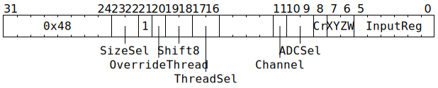

# `REG2FLOP` (Move from GPRs to ADCs)

**Summary:** Move between 8 and 32 bits of a GPR to an ADC value, where it can subsequently be used for unpacker or packer address computations. To instead move a constant to an ADC value, see `SETADC` or `SETADCXX` or `SETADCXY` or `SETADCZW`.

**Backend execution unit:** [Scalar Unit (ThCon)](ScalarUnit.md)

## Syntax

```c
TT_REG2FLOP(/* u2 */ SizeSel,
            2 + /* bool */ OverrideThread,
            /* u2 */ Shift8,
            /* u2 */ ThreadSel,
          ((/* u1 */ Channel) << 5) +
          ((/* u2 */ ADCSel) << 3) +
          ((/* bool */ Cr) << 2) +
            /* u2 */ XYZW,
            /* u6 */ InputReg)
```

## Encoding



## Functional model

```c
uint32_t Value = GPRs[CurrentThread][InputReg];
switch (SizeSel) {
case 0: // 128 bit (not valid)
  Value = 0;
  break;
case 1: // 32 bit
  if (Shift8 != 0) Value = 0;
  break;
case 2: // 16 bit
  if (Shift8 == 0) Value &= 0xffff;
  else if (Shift8 == 2) Value >>= 16;
  else Value = 0;
  break;
case 3: // 8 bit
  Value = (Value >> (Shift8 * 8)) & 0xff;
  break;
}

uint2_t WhichThread = CurrentThread;
if (OverrideThread) {
  WhichThread = ThreadSel;
  if (WhichThread >= 3) return;
}
ADC* ADC_;
switch (ADCSel) {
case 0: ADC_ = &ADCs[WhichThread].Unpacker[0]; break;
case 1: ADC_ = &ADCs[WhichThread].Unpacker[1]; break;
case 2: ADC_ = &ADCs[WhichThread].Packers; break;
case 3: return;
}
auto& Ch = ADC_->Channel[Channel];

switch (XYZW) {
case 0: Cr ? Ch.X_Cr = Value : Ch.X = Value; break;
case 1: Cr ? Ch.Y_Cr = Value : Ch.Y = Value; break;
case 2: Cr ? Ch.Z_Cr = Value : Ch.Z = Value; break;
case 3: Cr ? Ch.W_Cr = Value : Ch.W = Value; break;
}
```

## Performance

This instruction usually takes two cycles, though it will take longer if [Configuration Unit](ConfigurationUnit.md) instructions (from any Tensix thread or any baby RISCV) are writing to to THCON configuration. This is not a typo; it applies _even though_ this variant of `REG2FLOP` does not touch THCON configuration. The instruction occupies the [Scalar Unit (ThCon)](ScalarUnit.md) for the entire duration, and the issuing thread will be blocked from issuing subsequent instructions for the entire duration.
