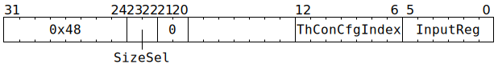

# `REG2FLOP` (Move from GPRs to THCON configuration)

**Summary:** Use the Scalar Unit (ThCon) to write to thread-agnostic backend configuration, but only for fields whose name starts with `THCON_`. In most cases, the [`WRCFG`](WRCFG.md) instruction should be used instead, unless explicitly trying to avoid contention around the [Configuration Unit](ConfigurationUnit.md).

**Backend execution unit:** [Scalar Unit (ThCon)](ScalarUnit.md)

## Syntax

```c
TT_REG2FLOP(/* u2 */ SizeSel, 0, 0, 0, /* u7 */ ThConCfgIndex, /* u6 */ InputReg)
```

## Encoding



## Functional model

```c
if (ThConCfgIndex >= (GLOBAL_CFGREG_BASE_ADDR32 - THCON_CFGREG_BASE_ADDR32)) {
  // Can only write to backend configuration whose field name starts with THCON_.
  // See WRCFG for a similar instruction without this limitation.
  UndefinedBehaviour();
}

uint1_t StateID = ThreadConfig[CurrentThread].CFG_STATE_ID_StateID;
uint32_t* ThConCfgBase = &Config[StateID][THCON_CFGREG_BASE_ADDR32];

if (SizeSel == 0) {
  // 128 bit configuration write
  memcpy(&ThConCfgBase[ThConCfgIndex & ~3], &GPRs[CurrentThread][InputReg & ~3], 16);
} else {
  // 32 bit configuration write
  ThConCfgBase[ThConCfgIndex] = GPRs[CurrentThread][InputReg];
}
```

## Performance

This instruction usually takes two cycles, though it will take longer if [Configuration Unit](ConfigurationUnit.md) instructions (from any Tensix thread or any baby RISCV) are contending for write bandwidth to THCON configuration. The instruction occupies the [Scalar Unit (ThCon)](ScalarUnit.md) for the entire duration, and the issuing thread will be blocked from issuing subsequent instructions for the entire duration.
