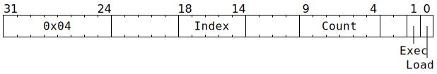

# `REPLAY` (Record or replay sequence of instructions)

**Summary:** Causes the next several Tensix instructions to be stored to the replay buffer instead of (or as well as) being executed, or expands to several Tensix instructions previously stored in the replay buffer.

**Frontend execution unit:** Replay Expander

## Syntax

```c
TT_REPLAY(/* u5 */ Index, /* u6 */ Count, /* u1 */ Exec, /* u1 */ Load)
```

## Encoding



## Functional model

The Replay Expander sits in the frontend of the Tensix coprocessor, after the MOP Expander and before the Wait Gate. It is the sole place where `REPLAY` instructions are handled, and the only thing it handles is `REPLAY` instructions. The behaviour of the Replay Expander can be described as an asynchronous generator acting on the instruction stream:

```py
async def ReplayExpander():
  ReplayBuffer = [0] * 32 # This is per-thread state, as there's an expander per thread
  while True:
    Instruction = await GetNextIncomingInstruction()
    if Instruction.Opcode != REPLAY:
      yield Instruction # Just pass through everything other than REPLAY
    elif Instruction.Load:
      Index = Instruction.Index
      Exec = Instruction.Exec
      for i in range(Instruction.Count or 64):
        Instruction = await GetNextIncomingInstruction()
        ReplayBuffer[(Index + i) % 32] = Instruction
        if Exec:
          yield Instruction
    else:
      Index = Instruction.Index
      for i in range(Instruction.Count or 64):
        yield ReplayBuffer[(Index + i) % 32]
```

## Performance

While not processing `REPLAY` instructions, or processing a `REPLAY` instruction with both `Load` and `Exec` set, each Replay Expander can ingest one instruction per cycle and emit one instruction per cycle.

Upon receiving a `REPLAY` instruction with `Load = false`, a Replay Expander will ingest the `REPLAY` instruction and emit a different instruction from its `ReplayBuffer`. For the next `Count - 1` cycles (or longer, if backpressured from downstream), it will not ingest anything (any incoming instructions will instead accumulate in the FIFO sitting before the expander), but it will emit one instruction per cycle from its `ReplayBuffer`.

Upon receiving a `REPLAY` instruction with `Load = true` and `Exec = false`, a Replay Expander will ingest the `REPLAY` instruction and emit nothing. For the next `Count` cycles (or longer, if there are gaps in the incoming instruction stream), it will ingest one instruction per cycle and emit nothing.

There are no transition penalties when switching between the various modes.
