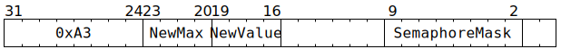

# `SEMINIT` (Set the `Value` and `Max` of some semaphores)

**Summary:** Various semaphores are selected using a bitmask, and the selected semaphores have their `Value` and `Max` set to the provided values. Note that `Max` is only subsequently used by [`SEMWAIT`](SEMWAIT.md); it has no effect on [`SEMPOST`](SEMPOST.md).

**Backend execution unit:** [Sync Unit](SyncUnit.md)

## Syntax

```c
TT_SEMINIT(/* u4 */ NewMax, /* u4 */ NewValue, /* u8 */ SemaphoreMask)
```

## Encoding



## Functional model

```c
atomic {
  for (unsigned i = 0; i < 8; ++i) {
    if (SemaphoreMask.Bit[i]) {
      Semaphores[i].Value = NewValue;
      Semaphores[i].Max = NewMax;
    }
  }
}
```

## Instruction scheduling

If the programmer intent is for the semaphore manipulation to happen after some earlier Tensix instruction has _finished_ execution, it may be necessary to insert a [`STALLWAIT`](STALLWAIT.md) instruction (with block bit B1) somewhere between that earlier instruction and the `SEMINIT` instruction.
