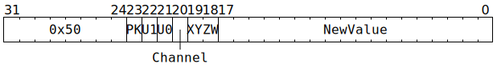

# `SETADC` (Set one ADC counter)

**Summary:**

**Backend execution unit:** [Miscellaneous Unit](MiscellaneousUnit.md)

## Syntax

```c
TT_SETADC(((/* bool */ PK) << 2) +
          ((/* bool */ U1) << 1) +
            /* bool */ U0,
            /* u1 */ Channel,
            /* u2 */ XYZW,
            /* u18 */ NewValue)
```

## Encoding



## Functional model

```c
uint2_t ThreadOverride = NewValue >> 16;
uint2_t WhichThread = ThreadOverride == 0 ? CurrentThread : ThreadOverride - 1;
if (U0) ApplyTo(ADCs[WhichThread].Unpacker[0]);
if (U1) ApplyTo(ADCs[WhichThread].Unpacker[1]);
if (PK) ApplyTo(ADCs[WhichThread].Packers);

void ApplyTo(ADC& ADC_) {
  auto& Ch = ADC_.Channel[Channel];
  switch (XYZW) {
  case 0: Ch.X = NewValue, Ch.X_Cr = NewValue; break;
  case 1: Ch.Y = NewValue, Ch.Y_Cr = NewValue; break;
  case 2: Ch.Z = NewValue, Ch.Z_Cr = NewValue; break;
  case 3: Ch.W = NewValue, Ch.W_Cr = NewValue; break;
  }
}
```
