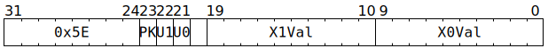

# `SETADCXX` (Set ADC X counters)

**Summary:**

**Backend execution unit:** [Miscellaneous Unit](MiscellaneousUnit.md)

## Syntax

```c
TT_SETADCXX(((/* bool */ PK) << 2) +
            ((/* bool */ U1) << 1) +
              /* bool */ U0,
              /* u10 */ X1Val,
              /* u10 */ X0Val)
```

## Encoding



## Functional model

```c
if (U0) ApplyTo(ADCs[CurrentThread].Unpacker[0]);
if (U1) ApplyTo(ADCs[CurrentThread].Unpacker[1]);
if (PK) ApplyTo(ADCs[CurrentThread].Packers);

void ApplyTo(ADC& ADC_) {
  ADC_.Channel[0].X = X0Val, ADC_.Channel[0].X_Cr = X0Val;
  ADC_.Channel[1].X = X1Val, ADC_.Channel[1].X_Cr = X1Val;
}
```
