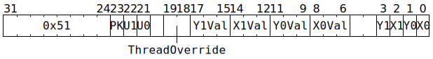

# `SETADCXY` (Set some ADC X and Y counters)

**Summary:**

**Backend execution unit:** [Miscellaneous Unit](MiscellaneousUnit.md)

## Syntax

```c
TT_SETADCXY(((/* bool */ PK) << 2) +
            ((/* bool */ U1) << 1) +
              /* bool */ U0,
              /* u3 */ Y1Val,
              /* u3 */ X1Val,
              /* u3 */ Y0Val,
              /* u3 */ X0Val,
            ((/* bool */ Y1) << 3) +
            ((/* bool */ X1) << 2) +
            ((/* bool */ Y0) << 1) +
              /* bool */ X0)
```

There is no syntax to specify `/* u2 */ ThreadOverride`; if a non-zero value is desired for this field, the raw encoding must be used.

## Encoding



## Functional model

```c
uint2_t WhichThread = ThreadOverride == 0 ? CurrentThread : ThreadOverride - 1;
if (U0) ApplyTo(ADCs[WhichThread].Unpacker[0]);
if (U1) ApplyTo(ADCs[WhichThread].Unpacker[1]);
if (PK) ApplyTo(ADCs[WhichThread].Packers);

void ApplyTo(ADC& ADC_) {
  if (X0) ADC_.Channel[0].X = X0Val, ADC_.Channel[0].X_Cr = X0Val;
  if (Y0) ADC_.Channel[0].Y = Y0Val, ADC_.Channel[0].Y_Cr = Y0Val;
  if (X1) ADC_.Channel[1].X = X1Val, ADC_.Channel[1].X_Cr = X1Val;
  if (Y1) ADC_.Channel[1].Y = Y1Val, ADC_.Channel[1].Y_Cr = Y1Val;
}
```
