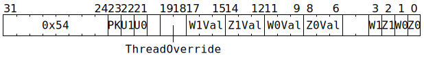

# `SETADCZW` (Set some ADC Z and W counters)

**Summary:**

**Backend execution unit:** [Miscellaneous Unit](MiscellaneousUnit.md)

## Syntax

```c
TT_SETADCZW(((/* bool */ PK) << 2) +
            ((/* bool */ U1) << 1) +
              /* bool */ U0,
              /* u3 */ W1Val,
              /* u3 */ Z1Val,
              /* u3 */ W0Val,
              /* u3 */ Z0Val,
            ((/* bool */ W1) << 3) +
            ((/* bool */ Z1) << 2) +
            ((/* bool */ W0) << 1) +
              /* bool */ Z0)
```

There is no syntax to specify `/* u2 */ ThreadOverride`; if a non-zero value is desired for this field, the raw encoding must be used.

## Encoding



## Functional model

```c
uint2_t WhichThread = ThreadOverride == 0 ? CurrentThread : ThreadOverride - 1;
if (U0) ApplyTo(ADCs[WhichThread].Unpacker[0]);
if (U1) ApplyTo(ADCs[WhichThread].Unpacker[1]);
if (PK) ApplyTo(ADCs[WhichThread].Packers);

void ApplyTo(ADC& ADC_) {
  if (Z0) ADC_.Channel[0].Z = Z0Val, ADC_.Channel[0].Z_Cr = Z0Val;
  if (W0) ADC_.Channel[0].W = W0Val, ADC_.Channel[0].W_Cr = W0Val;
  if (Z1) ADC_.Channel[1].Z = Z1Val, ADC_.Channel[1].Z_Cr = Z1Val;
  if (W1) ADC_.Channel[1].W = W1Val, ADC_.Channel[1].W_Cr = W1Val;
}
```
