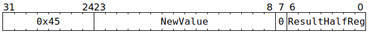

# `SETDMAREG` (Set 16 bits of one GPR)

**Summary:** Write 16 bits to one half of a Tensix GPR, leaving the other half as-is. Note that all 32 bits of a GPR can be set by using two `SETDMAREG` instructions.

**Backend execution unit:** [Scalar Unit (ThCon)](ScalarUnit.md)

## Syntax

```c
TT_SETDMAREG(0, /* u16 */ NewValue, 0, /* u7 */ ResultHalfReg)
```

## Encoding



## Functional model

```c
uint16_t *HalfReg = (char*)&GPRs[CurrentThread][0] + ResultHalfReg * 2;
*HalfReg = NewValue;
```

## Performance

This instruction executes in a single cycle, though if the Scalar Unit is busy with other instructions, it might have to wait at the Wait Gate until the Scalar Unit can accept it.
