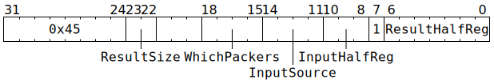

# `SETDMAREG` (Read packer configuration or state into GPRs)

**Summary:** Read 128 bits of packer configuration or state, and write between 16 and 128 bits of that to GPRs. Can also be used to set four consecutive GPRs to zero.

**Backend execution unit:** [Scalar Unit (ThCon)](ScalarUnit.md)

## Syntax

```c
TT_SETDMAREG(/* u2 */ ResultSize,
           ((/* u4 */ WhichPackers) << 7) +
           ((/* u4 */ InputSource ) << 3) +
             /* u3 */ InputHalfReg,
             1,
             /* u7 */ ResultHalfReg)
```

## Encoding



## Functional model

```c
typedef struct {
  // First 32 bits:
  uint16_t TileSize;
  uint16_t reserved;
  // Next 32 bits: (in order, from least significant bits)
  uint16_t reserved;
  uint4_t DataFormat;
  uint1_t DisableZeroCompression;
  uint3_t SpareBits;
  uint8_t reserved;
  // Next 32 bits:
  uint32_t AllZeroFlags;
  // Final 32 bits:
  uint32_t reserved;
} __attribute__((packed)) TileHeader;

// Various 128 bit values, chosen using InputSource field.
uint32_t Values[4] = {0};
switch (InputSource) {
case 0:
  for (unsigned i = 0; i < 4; ++i) {
    uint16_t hi = Packers[i].AccTileSize[CurrentThread];
    uint16_t lo = Packers[i].LastThread == CurrentThread ? Packers[i].LastTileSize : 0;
    Values[i] = (uint32_t(hi) << 16) + lo;
  }
  break;
case 1:
  for (unsigned i = 0; i < 4; ++i) {
    Values[i] = Packers[i].AllZeroFlags;
  }
  break;
case 2: case 3: case 4: case 5:
  unsigned i = InputSource - 2;
  uint1_t StateID = ThreadConfig[CurrentThread].CFG_STATE_ID_StateID;
  TileHeader *ValuesTH = (TileHeader*)&Values;
  ValuesTH->TileSize = (Packers[i].LastThread == CurrentThread ? Packers[i].LastTileSize : 0) + 1;
  ValuesTH->DataFormat = Packers[i].Config[StateID].Out_data_format;
  // Note:
  // Packers[0].Config[x].Out_data_format is Config[x].THCON_SEC0_REG1_Out_data_format
  // Packers[1].Config[x].Out_data_format is Config[x].THCON_SEC0_REG8_Out_data_format
  // Packers[2].Config[x].Out_data_format is Config[x].THCON_SEC1_REG1_Out_data_format
  // Packers[3].Config[x].Out_data_format is Config[x].THCON_SEC1_REG8_Out_data_format
  if (Config[StateID].THCON_SEC0_REG1_All_pack_disable_zero_compress_ovrd) {
    ValuesTH->DisableZeroCompression = Config[StateID].THCON_SEC0_REG1_All_pack_disable_zero_compress.Bit[i];
  } else {
    ValuesTH->DisableZeroCompression = Packers[i].Config[StateID].Disable_zero_compress;
    // Note:
    // Packers[0].Config[x].Disable_zero_compress is Config[x].THCON_SEC0_REG1_Disable_zero_compress
    // Packers[1].Config[x].Disable_zero_compress is Config[x].THCON_SEC0_REG8_Disable_zero_compress
    // Packers[2].Config[x].Disable_zero_compress is Config[x].THCON_SEC1_REG1_Disable_zero_compress
    // Packers[3].Config[x].Disable_zero_compress is Config[x].THCON_SEC1_REG8_Disable_zero_compress
  }
  ValuesTH->AllZeroFlags = Packers[i].AllZeroFlags;
  break;
case 6: case 7:
  // Here WhichPackers is used as an index.
  memcpy(&Values[0], &Packers[WhichPackers & 3].ExponentHistogram[(InputSource - 6) * 16], 16);
  // ExponentHistogram is an array of 32 bytes, where each byte is a saturating counter, serving as a histogram
  // of observed exponent values. For FP formats with 8 bits of exponent, the low five bits serve as a
  // histogram bin index, so this is only really useful for FP formats with 5 bits of exponent.
  break;
case 8:
  for (unsigned i = 0; i < 4; ++i) {
    Values[0].Bit[i] = Packers[i].AllZeroFlags.Bit[0];
    // Here WhichPackers is used as a mask.
    if (WhichPackers.Bit[i]) {
      Packers[i].ResetAccTileSize();
    }
  }
  break;
case 9:
  Values[0] = Packers[0].ExponentHistogramMaxExponent;
  break;
}

// Write between 16 and 128 bits to GPRs.
switch (ResultSize) {
case 0: // 16-bit (any half of any value written to any half of any GPR)
  ((uint16_t*)&GPRs[CurrentThread][0])[ResultHalfReg] = ((uint16_t*)&Values[0])[InputHalfReg];
  break;
case 1: // 32-bit (one value written to one GPR)
  GPRs[CurrentThread][ResultHalfReg >> 1] = Values[InputHalfReg >> 1];
  break;
case 2: // 128-bit (write values to four consecutive GPRs)
  memcpy(&GPRs[CurrentThread][(ResultHalfReg >> 1) & 0x3c], Values, 16);
  break;
case 3: // 128-bit, but leaving reserved fields of tile header unchanged
  TileHeader *ResultTH = (TileHeader*)&GPRs[CurrentThread][(ResultHalfReg >> 1) & 0x3c];
  TileHeader *ValuesTH = (TileHeader*)&Values;
  ResultTH->TileSize = ValuesTH->TileSize;
  ResultTH->DataFormat = ValuesTH->DataFormat;
  ResultTH->DisableZeroCompression = ValuesTH->DisableZeroCompression;
  ResultTH->SpareBits = ValuesTH->SpareBits;
  ResultTH->AllZeroFlags = ValuesTH->AllZeroFlags;
  break;
}
```

## Performance

This instruction executes in a single cycle, though if the Scalar Unit is busy with other instructions, it might have to wait at the Wait Gate until the Scalar Unit can accept it.
