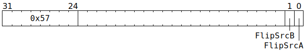

# `SETDVALID` (Give `SrcA` / `SrcB` banks to Matrix Unit)

**Summary:** The `SrcA` and/or `SrcB` banks currently being used by the Unpackers are given to the [Matrix Unit (FPU)](MatrixUnit.md), and then the relevant Unpacker(s) are prepared for writing to the other `SrcA` and/or `SrcB` bank.

See also [`CLEARDVALID`](CLEARDVALID.md).

**Backend execution unit:** [Miscellaneous Unit](MiscellaneousUnit.md)

## Syntax

```c
TT_SETDVALID(((/* bool */ FlipSrcB) << 1) +
               /* bool */ FlipSrcA)
```

## Encoding



## Functional model

```c
if (FlipSrcA) {
  SrcA[Unpackers[0].SrcBank].AllowedClient = SrcClient::MatrixUnit;
  Unpackers[0].SrcBank ^= 1;
  Unpackers[0].SrcRow[CurrentThread] = ThreadConfig[CurrentThread].SRCA_SET_Base << 4;
}
if (FlipSrcB) {
  SrcB[Unpackers[1].SrcBank].AllowedClient = SrcClient::MatrixUnit;
  Unpackers[1].SrcBank ^= 1;
  Unpackers[1].SrcRow[CurrentThread] = ThreadConfig[CurrentThread].SRCB_SET_Base << 4;
}
```
