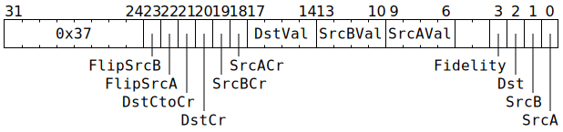

# `SETRWC` (Set RWC SrcA / SrcB / Dst / Fidelity counters)

**Summary:**

**Backend execution unit:** [Matrix Unit (FPU)](MatrixUnit.md)

## Syntax

```c
TT_SETRWC(((/* bool */ FlipSrcB) << 1) +
            /* bool */ FlipSrcA,
          ((/* bool */ DstCtoCr) << 3) +
          ((/* bool */ DstCr) << 2) +
          ((/* bool */ SrcBCr) << 1) +
            /* bool */ SrcACr,
            /* u4 */ DstVal,
            /* u4 */ SrcBVal,
            /* u4 */ SrcAVal,
          ((/* bool */ Fidelity) << 3) +
          ((/* bool */ Dst) << 2) +
          ((/* bool */ SrcB) << 1) +
            /* bool */ SrcA);
```

## Encoding



## Functional model

```c
auto& RWC = RWCs[CurrentThread];
if (SrcA) {
  if (SrcACr) SrcAVal += RWC.SrcA_Cr;
  RWC.SrcA = SrcAVal;
  RWC.SrcA_Cr = SrcAVal;
}
if (SrcB) {
  if (SrcBCr) SrcBVal += RWC.SrcB_Cr;
  RWC.SrcB = SrcBVal;
  RWC.SrcB_Cr = SrcBVal;
}
if (Dst || DstCtoCr) {
  if (DstCtoCr) DstVal += RWC.Dst;
  else if (DstCr) DstVal += RWC.Dst_Cr;
  RWC.Dst = DstVal;
  RWC.Dst_Cr = DstVal;
}
if (Fidelity) {
  RWC.FidelityPhase = 0;
}

if (FlipSrcA) {
  if (!ThreadConfig[CurrentThread].CLR_DVALID_SrcA_Disable) {
    SrcA[MatrixUnit.SrcABank].AllowedClient = SrcClient::Unpackers;
  }
  MatrixUnit.SrcABank ^= 1;
}
if (FlipSrcB) {
  if (!ThreadConfig[CurrentThread].CLR_DVALID_SrcB_Disable) {
    SrcB[MatrixUnit.SrcBBank].AllowedClient = SrcClient::Unpackers;
  }
  MatrixUnit.SrcBBank ^= 1;
}
```
