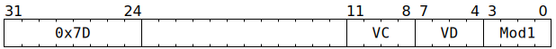

# `SFPABS` (Vectorised floating-point or two's complement absolute value)

**Summary:** Performs lanewise absolute value on a vector of two's complement integers or a vector of FP32. In the latter case, -NaN is left as -NaN rather than becoming +NaN. To instead take the absolute value on a vector of sign-magnitude integers, or a vector of FP32 without special case handling of NaN, [`SFPSETSGN`](SFPSETSGN.md) can be used.

**Backend execution unit:** [Vector Unit (SFPU)](VectorUnit.md), simple sub-unit

## Syntax

```c
TT_SFPABS(0, /* u4 */ VC, /* u4 */ VD, /* u4 */ Mod1)
```

## Encoding



## Functional model

```c
if (VD < 8 || VD == 16) {
  lanewise {
    if (LaneEnabled) {
      uint32_t x = LReg[VC].u32;
      if (x >= 0x80000000u) {
        // Sign bit is set, i.e. value is negative.
        if (Mod1 & SFPABS_MOD1_FLOAT) {
          if (x >= 0xff800000u) {
            // Value is -NaN; leave it as -NaN.
          } else {
            // Clear the sign bit, i.e. floating-point negation.
            x &= 0x7fffffffu;
          }
        } else {
          // Two's complement integer negation, unless the input is
          // -2147483648, in which case it remains as -2147483648.
          x = -x;
        }
      } else {
        // Value is positive (or zero); leave it as-is.
      }
      LReg[VD].u32 = x;
    }
  }
}
```

Supporting definitions:
```c
#define SFPABS_MOD1_FLOAT 1
```
