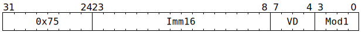

# `SFPADDI` (Vectorised floating-point addition using BF16 immediate)

**Summary:** Performs lanewise FP32 `VD += BF16ToFP32(Imm16)`.

**Backend execution unit:** [Vector Unit (SFPU)](VectorUnit.md), MAD sub-unit

## Syntax

```c
TT_SFPADDI(/* u16 */ Imm16, /* u4 */ VD, /* u4 */ Mod1)
```

## Encoding



## Functional model

```c
unsigned VC = VD;
lanewise {
  if (LaneEnabled) {
    float c = LReg[VC].f32;
    float d = BF16ToFP32(Imm16) * 1.0 + c;
    unsigned vd;
    if ((Mod1 & SFPMAD_MOD1_INDIRECT_VD) && VD != 16) {
      vd = LReg[7].u32 & 15;
    } else {
      vd = VD;
    }
    if (vd < 8 || vd == 16) {
      LReg[vd].f32 = d;
    }
  }
}
```

Supporting definitions:

```c
#define SFPMAD_MOD1_INDIRECT_VD 8

float BF16ToFP32(uint16_t x) {
  float result;
  uint32_t y = uint32_t(x) << 16;
  memcpy(&result, &y, 4);
  return result;
}
```

## IEEE754 conformance / divergence

As per [`SFPMAD`](SFPMAD.md#ieee754-conformance--divergence).

## Instruction scheduling

If `SFPADDI` is used, software must ensure that on the next cycle, the Vector Unit (SFPU) does not execute an instruction which reads from any location written to by the `SFPADDI`. A NOP instruction can be inserted to ensure this (any kind of Tensix NOP suffices, though `SFPNOP` is conventional).
