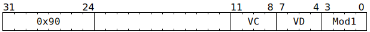

# `SFPCAST` (Vectorised convert sign-magnitude integer to floating-point)

**Summary:** Performs lanewise conversion of 32-bit sign-magnitude integers to FP32. The conversion is exact for inputs <code>|x| ≤ 2<sup>24</sup></code>. Inputs outside this range require rounding, which can either be stochastic or round to nearest with ties to even.

**Backend execution unit:** [Vector Unit (SFPU)](VectorUnit.md), simple sub-unit

## Syntax

```c
TT_SFPCAST(/* u4 */ VC, /* u4 */ VD, /* u4 */ Mod1)
```

## Encoding



## Functional model

```c
lanewise {
  if (VD < 12 || VD == 16 || LaneConfig.DISABLE_BACKDOOR_LOAD) {
    if (LaneEnabled) {
      uint32_t c = LReg[VC].u32; // Sign-magnitude integer.
      uint32_t Sign = c & 0x80000000u;
      uint32_t Mag  = c & 0x7fffffffu;
      uint32_t LZ = Mag ? __builtin_clz(Mag) : 157;
      uint32_t Norm = Mag << (LZ & 31);
      uint32_t d = Sign + ((157 - LZ) << 23) + (Norm >> 8); // FP32.
      if (Mod1 & SFPCAST_MOD1_RND_STOCH) {
        // Stochastic rounding using seven bits of PRNG.
        if ((Norm & 0xfe) > ((AdvancePRNG() >> 9) & 0xfe)) d += 1;
      } else {
        // Round to nearest, ties to even.
        if ((Norm & 0x80) && (Norm & 0x17f)) d += 1;
      }
      if (VD < 8 || VD == 16) {
        LReg[VD].u32 = d;
      }
    }
  }
}
```

Supporting definitions:
```c
#define SFPCAST_MOD1_RND_STOCH 1
```
