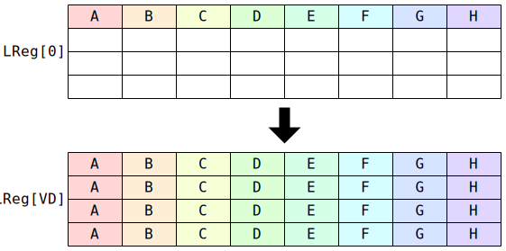

# `SFPCONFIG` (Manipulate Vector Unit configuration)

**Summary:** In its simplest mode, `SFPCONFIG` moves values to `LReg[11]` through `LReg[14]`. In the next mode up, `SFPCONFIG` manipulates `LaneConfig`. In its most complex modes, it manipulates `LoadMacroConfig`, which is used by the `SFPLOADMACRO` instruction.

All of this state is described as having 32 lanes for the purpose of exposition, but `SFPCONFIG` always takes input from just the first 8 lanes, and vertically broadcasts 8 lanes up to 32 lanes.

**Backend execution unit:** [Vector Unit (SFPU)](VectorUnit.md)

## Syntax

```c
TT_SFPCONFIG(/* u16 */ Imm16, /* u4 */ VD, /* u4 */ Mod1)
```

## Encoding


## Cross-lane data movement pattern

When `MOD1_IMM16_IS_VALUE` is specified, the value (usually) comes from `Imm16`. In other cases, it comes from `LReg[0]`:



## Functional model

```c
for (unsigned Lane = 0; Lane < 32; ++Lane) {
  if (Mod1 & MOD1_IMM16_IS_LANE_MASK) {
    // Software should generally avoid taking this branch if also
    // setting MOD1_IMM16_IS_VALUE, as that can cause Imm16 to be
    // used for both purposes simultaneously.
    if (!Imm16.Bit[(Lane & 7) * 2]) continue;
  }
  if (LaneFlagsEnabled) {
    if (!LaneFlags.Bit[Lane & 7]) continue;
  }

  switch (VD) {
  case 0: case 1: case 2: case 3:
    // Write to LoadMacroConfig::InstructionTemplate.
    // Not enough Imm16 bits to specify a 32-bit instruction, so
    // these cases completely ignore MOD1_IMM16_IS_VALUE.
    LoadMacroConfig[Lane].InstructionTemplate[VD] = LReg[0][Lane & 7];
    break;
  case 4: case 5: case 6: case 7: {
    // Write to LoadMacroConfig::Sequence.
    uint32_t Value = (Mod1 & MOD1_IMM16_IS_VALUE) ? Imm16 : LReg[0][Lane & 7];
    LoadMacroConfig[Lane].Sequence[VD - 4] = Value;
    break; }
  case 8: {
    // Write or manipulate LoadMacroConfig::Misc.
    uint12_t Value = (Mod1 & MOD1_IMM16_IS_VALUE) ? Imm16 : LReg[0][Lane & 7];
    switch (Mod1 & 6) {
    case 0:                LoadMacroConfig[Lane].Misc  = Value; break;
    case MOD1_BITWISE_OR:  LoadMacroConfig[Lane].Misc |= Value; break;
    case MOD1_BITWISE_AND: LoadMacroConfig[Lane].Misc &= Value; break;
    case MOD1_BITWISE_XOR: LoadMacroConfig[Lane].Misc ^= Value; break;
    }
    break; }
  case 9: case 10:
    // Does nothing.
    break;
  case 11: case 12: case 13: case 14: {
    // Write to LReg[VD].
    float Value;
    if (Mod1 & MOD1_IMM16_IS_VALUE) {
      // Not enough Imm16 bits to specify a 32-bit float, so
      // use a "default" value rather than trying to use Imm16.
      switch (VD) {
      case 11: Value = -1.f; break;
      case 12: Value = 1/65536.f; break;
      case 13: Value = -0.67487759f; break;
      case 14: Value = -0.34484843f; break;
      }
    } else {
      Value = LReg[0][Lane & 7].f32;
    }
    LReg[VD][Lane].f32 = Value;
    break; }
  case 15: {
    // Write or manipulate LaneConfig.
    uint18_t Original = LaneConfig[Lane];
    uint18_t Value = (Mod1 & MOD1_IMM16_IS_VALUE) ? Imm16 : LReg[0][Lane & 7];
    switch (Mod1 & 6) {
    case 0:                LaneConfig[Lane]  = Value; break;
    case MOD1_BITWISE_OR:  LaneConfig[Lane] |= Value; break;
    case MOD1_BITWISE_AND: LaneConfig[Lane] &= Value; break;
    case MOD1_BITWISE_XOR: LaneConfig[Lane] ^= Value; break;
    }
    if (Mod1 & MOD1_IMM16_IS_VALUE) {
      // Not enough Imm16 bits to reach the high bits of LaneConfig, so put
      // the high bits back to what they were to start with.
      LaneConfig[Lane] |= Original & ~0xffff;
    }
    break; }
  }
}
```

Supporting definitions:
```c
#define MOD1_IMM16_IS_VALUE     1
#define MOD1_BITWISE_OR         2
#define MOD1_BITWISE_AND        4
#define MOD1_BITWISE_XOR        6
#define MOD1_IMM16_IS_LANE_MASK 8
```
