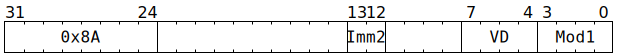

# `SFPENCC` (Enable or disable vector conditional execution)

**Summary:** Used to set `UseLaneFlagsForLaneEnable`. When `UseLaneFlagsForLaneEnable` is `true`, the per-lane `LaneFlags` boolean acts as a predication mask on Vector Unit (SFPU) instructions, allowing some lanes to be active whilst others are not.

**Backend execution unit:** [Vector Unit (SFPU)](VectorUnit.md), simple sub-unit

## Syntax

```c
TT_SFPENCC(/* u2 */ Imm2, 0, /* u4 */ VD, /* u4 */ Mod1)
```

## Encoding



## Functional model

```c
lanewise {
  if (VD < 12 || LaneConfig.DISABLE_BACKDOOR_LOAD) {
    if (Mod1 & SFPENCC_MOD1_EI) {
      UseLaneFlagsForLaneEnable = (Mod1 & SFPENCC_IMM12_E) != 0;
    } else if (Mod1 & SFPENCC_MOD1_EC) {
      UseLaneFlagsForLaneEnable = !UseLaneFlagsForLaneEnable;
    } else {
      // UseLaneFlagsForLaneEnable left as-is.
    }

    if (Mod1 & SFPENCC_MOD1_RI) {
      LaneFlags = (Mod1 & SFPENCC_IMM12_R) != 0;
    } else {
      LaneFlags = true;
    }
  }
}
```

Supporting definitions:
```c
#define SFPENCC_MOD1_EC 1 // Invert UseLaneFlagsForLaneEnable
#define SFPENCC_MOD1_EI 2 // Set UseLaneFlagsForLaneEnable from SFPENCC_IMM12_E 
#define SFPENCC_MOD1_RI 8 // Set LaneFlags from SFPENCC_IMM12_R

#define SFPENCC_IMM12_E 1 // Immediate bit for UseLaneFlagsForLaneEnable
#define SFPENCC_IMM12_R 2 // Immediate bit for LaneFlags
```
