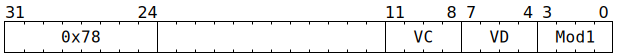

# `SFPEXMAN` (Vectorised extract FP32 mantissa bits)

**Summary:** Performs lanewise extraction of FP32 mantissa bits, depositing them in the low 23 bits. The next significant bit can be set to either `0` or `1`, and then the top 8 bits are always set to zero.

**Backend execution unit:** [Vector Unit (SFPU)](VectorUnit.md), simple sub-unit

## Syntax

```c
TT_SFPEXMAN(0, /* u4 */ VC, /* u4 */ VD, /* u4 */ Mod1)
```

## Encoding



## Functional model

```c
uint32_t HiddenBit = Mod1 & SFPEXMAN_MOD1_PAD9 ? 0 : 1u << 23;
if (VD < 8 || VD == 16) {
  lanewise {
    if (LaneEnabled) {
      uint32_t c = LReg[VC].u32; // FP32.
      uint32_t Man = c & 0x7fffff;
      LReg[VD].u32 = HiddenBit + Man; // Any kind of integer.
    }
  }
}
```

Supporting definitions:
```c
#define SFPEXMAN_MOD1_PAD9 1
```
