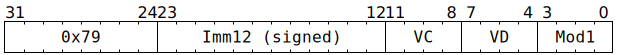

# `SFPIADD` (Vectorised integer addition or subtraction)

**Summary:** Performs lanewise addition or subtraction between two vectors of 32-bit unsigned integers or 32-bit signed two's complement integers, or adds a signed 12-bit immediate to all lanes of such a vector. Lane flags can also be set based on the sign of the result.

**Backend execution unit:** [Vector Unit (SFPU)](VectorUnit.md), simple sub-unit

## Syntax

```c
TT_SFPIADD(/* i12 */ (Imm12 & 0xfff), /* u4 */ VC, /* u4 */ VD, /* u4 */ Mod1)
```

## Encoding



## Functional model

```c
unsigned VB = VD;
if (VD < 8 || VD == 16) {
  lanewise {
    if (LaneEnabled) {
      if (Mod1 & SFPIADD_MOD1_ARG_IMM) {
        LReg[VD].u32 = LReg[VC].u32 + SignExtend(Imm12);
      } else if (Mod1 & SFPIADD_MOD1_ARG_2SCOMP_LREG_DST) {
        LReg[VD].u32 = LReg[VC].u32 - LReg[VB].u32;
      } else {
        LReg[VD].u32 = LReg[VC].u32 + LReg[VB].u32;
      }
      if (VD < 8) {
        if (Mod1 & SFPIADD_MOD1_CC_NONE) {
          // Leave LaneFlags as-is.
        } else {
          LaneFlags = int32_t(LReg[VD].u32) < 0;
        }
        if (Mod1 & SFPIADD_MOD1_CC_GTE0) {
          LaneFlags = !LaneFlags;
        }
      }
    }
  }
}
```

Supporting definitions:
```c
#define SFPIADD_MOD1_ARG_LREG_DST        0
#define SFPIADD_MOD1_ARG_IMM             1
#define SFPIADD_MOD1_ARG_2SCOMP_LREG_DST 2
#define SFPIADD_MOD1_CC_LT0  0
#define SFPIADD_MOD1_CC_NONE 4
#define SFPIADD_MOD1_CC_GTE0 8

uint32_t SignExtend(uint12_t x) {
  return (uint32_t)(int32_t)(int12_t)x;
}
```
