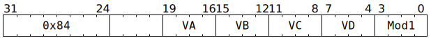

# `SFPMAD` (Vectorised floating-point multiply then add)

**Summary:** Performs lanewise FP32 `VD = VA * VB + VC`. In some modes, the `VA` and/or `VD` indices from the instruction bits are ignored, and instead come from the low four bits of `LReg[7]` (which allows these bits to potentially differ between lanes).

**Backend execution unit:** [Vector Unit (SFPU)](VectorUnit.md), MAD sub-unit

## Syntax

```c
TT_SFPMAD(/* u4 */ VA, /* u4 */ VB, /* u4 */ VC, /* u4 */ VD, /* u4 */ Mod1)
```

## Encoding



## Functional model

```c
lanewise {
  if (VD < 12 || LaneConfig[Lane].DISABLE_BACKDOOR_LOAD) {
    if (LaneEnabled) {
      unsigned va = Mod1 & SFPMAD_MOD1_INDIRECT_VA ? LReg[7].u32 & 15 : VA;
      float a = LReg[va].f32;
      float b = LReg[VB].f32;
      float c = LReg[VC].f32;
      float d = a * b + c;
      unsigned vd;
      if ((Mod1 & SFPMAD_MOD1_INDIRECT_VD) && VD != 16) {
        vd = LReg[7].u32 & 15;
      } else {
        vd = VD;
      }
      if (vd < 8 || vd == 16) {
        LReg[vd].f32 = d;
      }
    }
  }
}
```

Supporting definitions:

```c
#define SFPMAD_MOD1_INDIRECT_VA 4
#define SFPMAD_MOD1_INDIRECT_VD 8
```

## IEEE754 conformance / divergence

Denormal inputs are treated as if they were zero.

If any input is NaN or ±Infinity, then the result will be NaN or ±Infinity, following the usual IEEE754 rules. If a NaN is emitted, then the least significant bit of the mantissa is guaranteed to be set; other bits of the mantissa might or might not be set, and the sign bit might or might not be set.

The multiply and the add are _partially_ fused, but not _completely_ fused: the result of the multiplication is kept in higher precision than FP32, but is not kept in the infinite precision required to be a completely fused operation. A single rounding step is performed, with the rounding mode always round to nearest with ties to even. If multiplying by one or adding zero, then the partially fused operation is equivalent to a standalone add or standalone multiply (handling of denormals and negative zero notwithstanding).

If the output (before rounding) is denormal or negative zero, it'll be flushed to positive zero.

## Instruction scheduling

If `SFPMAD` is used, software must ensure that on the next cycle, the Vector Unit (SFPU) does not execute an instruction which reads from any location written to by the `SFPMAD`. An [`SFPNOP`](SFPNOP.md) instruction can be inserted to ensure this.

## Performance

Each `SFPMAD` instruction can perform 32 FP32 multiplications and 32 FP32 additions, for 64 FP32 operations total. Running at Wormhole's standard 1 GHz clock rate, this gives 0.064 TFLOP/s (per Vector Unit). To hit this number whilst simultaneously moving data in and out of the Vector Unit (SFPU), [`SFPLOADMACRO`](SFPLOADMACRO.md) needs to be used.
