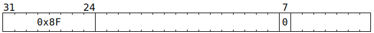

# `SFPNOP` (Occupy Vector Unit for one cycle)

**Summary:** Does nothing other than occupying a Vector Unit (SFPU) sub-unit for one cycle.

**Backend execution unit:** [Vector Unit (SFPU)](VectorUnit.md), load sub-unit (or, if scheduled via `SFPLOADMACRO`, simple sub-unit or MAD sub-unit or round sub-unit)

## Syntax

```c
TTI_SFPNOP
```

## Encoding



## Functional model

```c
// Causes no effects
```
