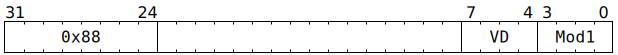

# `SFPPOPC` (Pop or peek vector conditional execution stack)

**Summary:** In its simplest mode, `SFPPOPC` pops from the vector conditional execution stack, replacing `LaneFlags` and `UseLaneFlagsForLaneEnable` with values popped from the stack. In its more complex modes, `SFPPOPC` peeks from the vector conditional execution stack, mutating `LaneFlags` and `UseLaneFlagsForLaneEnable` in various ways based on the contents of the top of the stack. The simple mode must not be used when the stack is empty. Due to a hardware bug, the complex modes should not be used when the stack is full.

**Backend execution unit:** [Vector Unit (SFPU)](VectorUnit.md), simple sub-unit

## Syntax

```c
TT_SFPPOPC(0, 0, /* u4 */ VD, /* u4 */ Mod1)
```

## Encoding



## Functional model

```c
lanewise {
  if (VD < 12 || LaneConfig.DISABLE_BACKDOOR_LOAD) {
    // Peek at stack top.
    FlagStackEntry Top;
    if (FlagStack.IsEmpty()) {
      Top.UseLaneFlagsForLaneEnable = false;
      Top.LaneFlags = false;
    } else {
      Top = FlagStack.Top();
    }

    if (Mod1 == 0) {
      // Plain pop from stack.
      if (FlagStack.IsEmpty()) {
        // Software should avoid using `Mod1 == 0` when the stack is empty.
        UndefinedBehaviour();
      }
      FlagStack.Pop();
    } else if (FlagStack.Size() == 8) {
      // This assignment is a hardware bug; to avoid hitting it, software
      // should not use `Mod1 != 0` when the stack is full.
      FlagStack.Bottom() = Top;
    }

    if (Mod1 == 0) {
      // Set LaneFlags and UseLaneFlagsForLaneEnable to Top.
      UseLaneFlagsForLaneEnable = Top.UseLaneFlagsForLaneEnable;
      LaneFlags = Top.LaneFlags;
    } else if (Mod1 <= 12) {
      // Mutate LaneFlags and UseLaneFlagsForLaneEnable based on Top.
      UseLaneFlagsForLaneEnable = Top.UseLaneFlagsForLaneEnable;
      LaneFlags = BooleanOp(Mod1, LaneFlags, Top.LaneFlags);
    } else if (Mod1 == 13) {
      // Just invert LaneFlags.
      LaneFlags = !LaneFlags;
    } else if (Mod1 == 14) {
      // Set LaneFlags and UseLaneFlagsForLaneEnable to constants.
      UseLaneFlagsForLaneEnable = true;
      LaneFlags = true;
    } else if (Mod1 == 15) {
      // Set LaneFlags and UseLaneFlagsForLaneEnable to constants.
      UseLaneFlagsForLaneEnable = true;
      LaneFlags = false;
    }
  }
}
```

Supporting definitions:
```c
bool BooleanOp(uint4_t Mod1, bool A, bool B) {
  switch (Mod1) {
  case  1: return        B;
  case  2: return       !B;
  case  3: return  A &&  B;
  case  4: return  A ||  B;
  case  5: return  A && !B;
  case  6: return  A || !B;
  case  7: return !A &&  B;
  case  8: return !A ||  B;
  case  9: return !A && !B;
  case 10: return !A || !B;
  case 11: return  A !=  B;
  case 12: return  A ==  B;
  }
}
```
