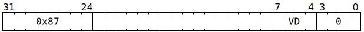

# `SFPPUSHC` (Push on to vector conditional execution stack)

**Summary:** Pushes a copy of the current lane predication masks (per-lane `LaneFlags` and `UseLaneFlagsForLaneEnable`) on to the vector conditional execution stack. The stack has a maximum capacity of eight elements, and this instruction must not be used if the stack is already full.

**Backend execution unit:** [Vector Unit (SFPU)](VectorUnit.md), simple sub-unit

## Syntax

```c
TT_SFPPUSHC(0, 0, /* u4 */ VD, 0)
```

## Encoding



## Functional model

```c
lanewise {
  if (VD < 12 || LaneConfig.DISABLE_BACKDOOR_LOAD) {
    if (FlagStack.Size() >= 8) {
      // Software should avoid using SFPPUSHC when the stack is full.
      UndefinedBehaviour();
    }
    FlagStack.Push({LaneFlags, UseLaneFlagsForLaneEnable});
  }
}
```
